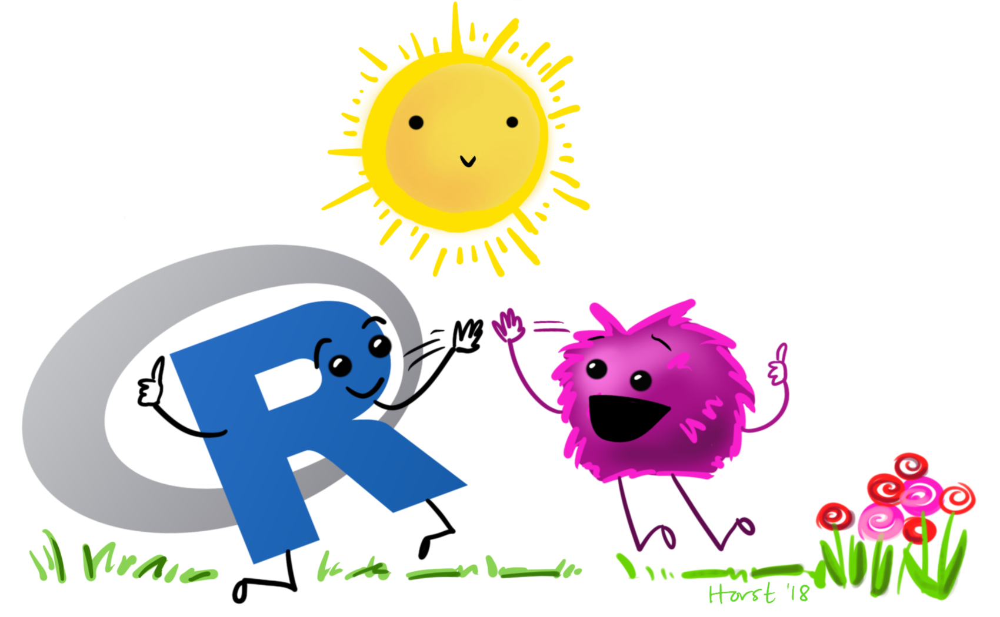
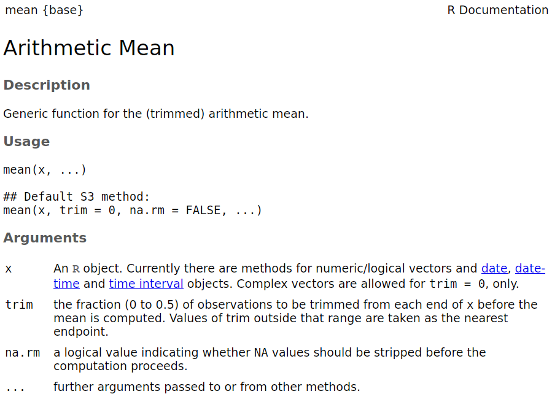

class: title-slide, nobar

## NRI 7350
# Getting started with R



.footnote[[@allison_horst](https://github.com/allisonhorst/stats-illustrations)]


```{r setup, include = FALSE}

hide_answers <- params$hide_answers

# Notes - 2020
# - Almost BANG on for time!
# - SLOOOOOOOW down on making a project
# - Double check that people have slides
# 
# Notes - 2021
# - Great timing ~ 65-70 min
# - Remember to show things like matching () etc.
#
# Assignment 2 - Have them run all the stats on the whole data, then compare with/without groups

knitr::opts_chunk$set(dpi = 150, fig.width = 7, fig.height = 4)
library(ggplot2)
library(flair)
library(palmerpenguins)
```

---
# Check-in

- Everyone getting emails?
    - Email about these slides?
- Everyone have access to these slides?  
  https://steffilazerte.ca/NRI_7350/slides.html

---
# About these Labs

## Format
- I will provide you tools and workflow to get started with R
- I will go over specific statistical functions
    - How to run them
    - How to interpret the results
- We'll have hands-on, lecture, and demonstrations

.spacer[]

## R is hard: But have no fear!
- Don't expect to remember everything!
- Copy/Paste is your friend (never apologize for using it!)
- Consider these labs a resource to return to

---
# About these Labs

## Format
- I will provide you tools and workflow to get started with R
- I will go over specific statistical functions
    - How to run them
    - How to interpret the results
- We'll have hands-on, lecture, and demonstrations


.spacer[]

## R is hard: But have no fear!
- **Don't expect to remember everything!**
- Copy/Paste is your friend (never apologize for using it!)
- Consider these labs a resource to return to

---
background-image: url(`r "figures/impostR_en.png"`)
background-position: center center
background-size: 70%

# Impost**R** Syndrome

---
background-image: url(`r "figures/impostR_en.png"`)
background-position: right 75px top 25%
background-size: 30%

# Impost**R** Syndrome


--


---
class: nobar


.footnote[[@allison_horst](https://github.com/allisonhorst/stats-illustrations)]


---
class: section

# About R

---
layout: true
# Why R?

---
background-image: url(`r "figures/R_hard.png"`)
background-position: right 15% bottom 10%
background-size: 70%

## R is hard

---
background-image: url(`r "figures/R_powerful2_edit.png"`)
background-position: center bottom 40%
background-size: 70%

## But R is powerful (and reproducible)!

--

.footnote[(I made these slides with **R**markdown)]

---
background-image: url(`r "figures/spatial.png"`)
background-position: center bottom 10%
background-size: 40%

## R is also beautiful

---
background-image: url(`r "figures/R_free.png"`)
background-position: center bottom 40%
background-size: 70%

## R is affordable (i.e., free!)


---
layout: false
class: section

# What is R?

---
# R is Programming language

> A programming **language** is a way to give instructions in order to get a computer to do something

- You need to know the language (i.e., the code)
- Computers don't know what you mean, only what you type (unfortunately)
- Spelling, punctuation, and capitalization all matter!

## For example

**R, what is 56 times 5.8?**

```{r}
56 * 5.8
```

---
# Use code to tell R what to do

**R, what is the average of numbers 1, 2, 3, 4?**

```{r}
mean(c(1, 2, 3, 4))
```

--

**R, save this value for later**

```{r}
steffis_mean <- mean(c(1, 2, 3, 4))
```

--

**R, multiply this value by 6**

```{r}
steffis_mean * 6
```

---
class: split-50
# Code, Output, Scripts

.columnl[
## Code
- The actual commands

## Output
- The result of running code or a script

## Script
- A text file full of code that you want to run
- You should always keep your code in a script
]


--

.columnr[

## For example:

```{r}
mean(c(1, 2, 3, 4))
```
]


---
# RStudio vs. R


- **RStudio** is not **R**
- RStudio is a User Interface or IDE (integrated development environment)
    - (i.e., Makes coding simpler)
- But sometimes tries to be **too** helpful

---
# RStudio Features

### Changing Options: Tools > Global Options

- General > Restore RData into workspace at startup (NO!)
- General > Save workspace to on exit (NEVER!)
- Code > Insert matching parens/quotes (Personal preference)

## Projects
- Handles working directories
- Organizes your work

## Packages
- Can use the package manager to install packages
- Can use the manager to load them as well, but not recommended
  - Load packages in your script so you remember which ones you used!


---
class: section

# Let's take a look at RStudio

## Set up a Project for this course


---
class: section

# Your first *real* code!

---
# First Code

```{r first_code, include = FALSE, message = FALSE, fig.width = 5, fig.asp = 0.4, out.width = '\"60%\"', fig.align = '"center"'}
# First load the package
library(tidyverse)

# Now create the figure
ggplot(data = msleep, aes(x = sleep_total, y = sleep_rem, colour = vore)) +
  geom_point()
```

```{r, echo = FALSE}
decorate("first_code", eval = FALSE)
```

.spacer[ ]

- Copy/paste or type this into the script window in RStudio
  - You may have to go to File > New File > R Script
- Click anywhere on the first line of code
- Use the 'Run' button to run this code, **or** use the short-cut `Ctrl-Enter`
    - Repeat until all the code has run

---
layout: true
# First Code

---


```{r, echo = FALSE}
decorate("first_code")
```

---

```{r echo = FALSE}
decorate("first_code") %>% 
  flair("tidyverse")
```


---

```{r echo = FALSE}
decorate("first_code") %>% 
  flair_funs()
```


---

```{r echo = FALSE}
decorate("first_code") %>% 
  flair("+")
```


---
```{r echo = FALSE}
decorate("first_code")
```


---
```{r echo = FALSE}
decorate("first_code")
```


---

```{r echo = FALSE}
decorate("first_code") %>%
  flair_rx("# (.)*")
```


---
layout:false
class: section
# R Basics: Objects

Objects are *things* in the environment  

(Check out the **Environment** pane in RStudio)


---
# `functions()`

## Do things, Return things

### Does something but returns nothing
e.g., `write_csv()` - Saves the `mtcars` data frame as a csv file

```{r, eval = FALSE}
write_csv(mtcars, path = "mtcars.csv")
```

.spacer[ ]

### Does something and returns something
e.g., `sd()` - returns the standard deviation of a vector 

```{r}
sd(c(4, 10, 21, 55))
```

---
class: split-50
# `functions()`

- Functions can take **arguments** (think 'options')
- `data`, `x`, `y`, `colour`

```{r args, include = FALSE}
ggplot(data = msleep, aes(x = sleep_total, y = sleep_rem, colour = vore)) +
  geom_point()
```

```{r, echo = FALSE}
decorate("args", eval = FALSE) %>%
  flair_args()
```


--


- Arguments defined by **name** or by **position**
- With correct position, do not need to specify by name


.columnl[
### By name:
```{r, echo = FALSE}
decorate("mean(x = c(1, 5, 10))") %>%
  flair("x = ")
```
]

.columnr[
### By order:
```{r, echo = FALSE}
decorate("mean(c(1, 5, 10))")
```
]

--


> Note that `c()` is also a function: combine or concatenate

---
class: split-40
# `functions()`

## Watch out for 'hidden' arguments

.columnl[
### By name:
```{r}
mean(x = c(1, 5, 10, NA), 
     na.rm = TRUE)
```
]

--

.columnr[
### By order:
```{r, error = TRUE}
mean(c(1, 5, 10, NA), 
     TRUE)
```
]

--


.center[This error states that we've assigned the argument `trim` to a non-valid argument]

.spacer[ ]

.center[Where did **`trim`** come from?]

---
# R documentation

```{r}
?mean
```


.center[**Your Turn:**  

Run this, what happens?  

Do you see the `trim` argument?]

--



---
class: split-40
# Data

Generally kept in `vectors` or `data.frames`/`tibbles`

- These are objects with names (like functions)
- We can use `<-` to assign values to objects (assignment)


.columnl[
## Vector (1 dimension)

```{r}
a <- c("a", "b", "c")
a
```
]

.columnr[
## Data frame (2 dimensions)

```{r}
d <- data.frame(letters = c("a", "b", "c"),
                numbers = c(1, 2, 3),
                treat = c("control", "control", "control"))
d
```
]


---
class: space
# Vectors

### Use `c()` to create a vector
```{r, results = "hide", R.options=list(width = 20)}
a <- c("apples", 12, "bananas")
```


### Use `x[index]` to access part of a vector

```{r, results = "hide"}
a[3] # [1] "bananas"
```


### Vectors contain one type of variable
(Even if you try to make it with more)
```{r, results = "hide"}
class(a) # [1] "character"
```

---
class: split-50
# Data frames (also tibbles)

.columnl[
### Create with `data.frame()`/`tibble()`
```{r}
my_data <- tibble(x = c("s1", "s2", "s3", "s4"),
                  y = c(101, 102, 103, 104),
                  z = c("a", "b", "c", "d"))
my_data
```

.small[(`dbl` = "Double" = Computer talk for non-integer number)]

]

--

.columnr[
### Cols have different types of variables

```{r}
str(my_data)
```
]


---
class: split-50
# Data frames (also tibbles)

.columnl[
### `x$colname` to pull out column

```{r}
my_data$x
```

### Or use `pull()` .small[(from `tidyverse`)]
```{r}
pull(my_data, x)
```
]

--

.columnr[
`x[row, col]` to access rows and columns of a data frame

```{r}
my_data[1:2, 2:3]
```
]


---
class: split-40
# Your Turn: Vectors and Data frames

### 1) Create a vector with 5 numbers and look at it
  - Find it in the "Global Environment" pane (upper right)
  - Type its name in the console and hit enter
  
```{r yt_vect, include = FALSE}
wings <- c(10, 42, 18, 12, 54)
wings
```
  
```{r echo = FALSE}
decorate("yt_vect", eval = FALSE) %>%
  mask("wings") %>%
  mask_rx("[0-9]{2}")
```


### 2) Create a data frame with `data.frame()` or `tibble()`
  - Click on it's name in the "Global Environment"
  - Type its name in the console and hit enter


```{r yt_df, include = FALSE}
sites <- data.frame(site = c("A1", "A2", "A3"),
                    vals = c(10, 51, 92))
sites
```

```{r, echo = FALSE}
decorate("yt_df", eval = FALSE) %>%
  mask("data.frame") %>%
  mask_rx("site(s)*") %>%
  mask("vals") %>%
  mask_rx("A[0-9]{1}") %>%
  mask_rx("[0-9]{2}")
```

---
exclude: `r hide_answers`
class: split-40
# Your Turn: Vectors and Data frames

### 1) Create a vector with 5 numbers and look at it
  - Find it in the "Global Environment" pane (upper right)
  - Type its name in the console and hit enter
  
```{r echo = FALSE}
decorate("yt_vect", eval = FALSE)
```


### 2) Create a data frame with `data.frame()` or `tibble()`
  - Click on its name in the "Global Environment"
  - Type its name in the console and hit enter

```{r, echo = FALSE}
decorate("yt_df", eval = FALSE)
```


---
class: section

# Miscellaneous

---
# R has spelling and punctuation

- R cares about spelling
- R is also case sensitive! (`Apple` is not the same as `apple`)
- Commas are used to separate arguments in functions

## For example

This is correct:
```{r, eval = FALSE}
mean(c(5, 7, 10))  # [1] 7.333333
```

This is **not** correct:
```{r, error = TRUE}
mean(c(5 7 10))
```

--

.box-r[\>80% of learning R is learning to **troubleshoot**]

---
class: space
# R has spelling and punctuation

### Spaces usually don't matter unless they change meanings

```{r, eval = FALSE}
5>=6    # [1] FALSE
5 >=6   # [1] FALSE
5 >= 6  # [1] FALSE
5 > = 6 # Error: unexpected '=' in "5 > ="
```

### Periods don't matter either, but can be used in the same way as letters
  .small[(But for complex programming reasons... don't)]

```{r}
apple.oranges <- "fruit"
```

---
class: space
# Assignments and Equal signs

### Use `<-` to assign values to objects

```{r}
a <- "hello"
```

### Use `=` to set function arguments

```{r, eval = FALSE}
mean(x = c(4, 9, 10))
```

### Use `==` to determine equivalence (logical)

```{r, eval = FALSE}
10 == 10 # [1] TRUE
10 == 9  # [1] FALSE
```

---
layout:true
# Braces/Brackets

---

## Round brackets: `()`

- Run functions (even if there are no arguments)

```{r}
Sys.Date() # Get the Current Date
```

--

- Without the `()`, R spits out information on the function:

```{r}
Sys.Date
```

--

.box-br[
`()` must be associated with a **function**  
.small[(Well, _almost_ always)]
]

---
## Square brackets: `[]`

- Extract parts of objects  

```{r, eval = TRUE}
LETTERS
LETTERS[1]
LETTERS[26]
```

--

.box-br[
`[]` have to be associated with an **object** that has dimensions  
.small[(Always)]
]

---
layout: false
# Improving code readability

### Use spaces like you would in sentences:
```{r}
a <- mean(c(4, 10, 13))
```

is easier to read than 

```{r}
a<-mean(c(4,10,13))
```

(But they are equivalent, coding-wise)

---
# Improving code readability

### Don't be afraid to use line breaks ('Enters') to make the code more readable

```{r}
a <- data.frame(exp = c("A", "B", "A", "B", "A", "B"), 
                sub = c("A1", "A1", "A2", "A2", "A3", "A3"), 
                res = c(10, 12, 45, 12, 12, 13))
```

vs.

```{r}
a <- data.frame(exp = c("A", "B", "A", "B", "A", "B"), sub = c("A1", "A1", "A2", "A2", "A3", "A3"), res = c(10, 12, 45, 12, 12, 13))
```


---
class: section
layout: false
# Reproducible research

---
# What is reproducible research?

## Remembering what you've done (and sharing)
- Keep scripts
- Annotate scripts (use comments)
- Date scripts!
- Compile scripts into reports or notebooks
- Include version information
    - `devtools::session_info()`

.box-b[We can use the "Compile Report" button in RStudio to create an HTML report of your work]

---
class: section
layout: false
# tidyverse?

---
# R base vs. tidyverse

## R base
- R base is basic R
- Most packages used are installed and loaded by default


--

## `tidyverse`
- Collection of 'new' packages developed by a team closely affiliated with RStudio
- Packages designed to work well together
- Use a slightly different syntax
- Among others, includes packages used for data transformations and visualizations:
    - e.g., `ggplot2`, `dplyr`, `tidyr`

--

> Can be helpful to understand whether functions are `tidyverse` or R base functions


---
# Wrapping up: Further reading

- http://www.cookbook-r.com
- [R for Data Science](http://r4ds.had.co.nz)
- [R base cheatsheet](https://www.rstudio.com/wp-content/uploads/2016/05/base-r.pdf)


