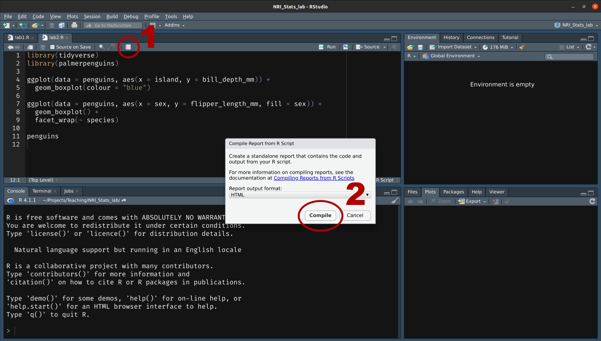
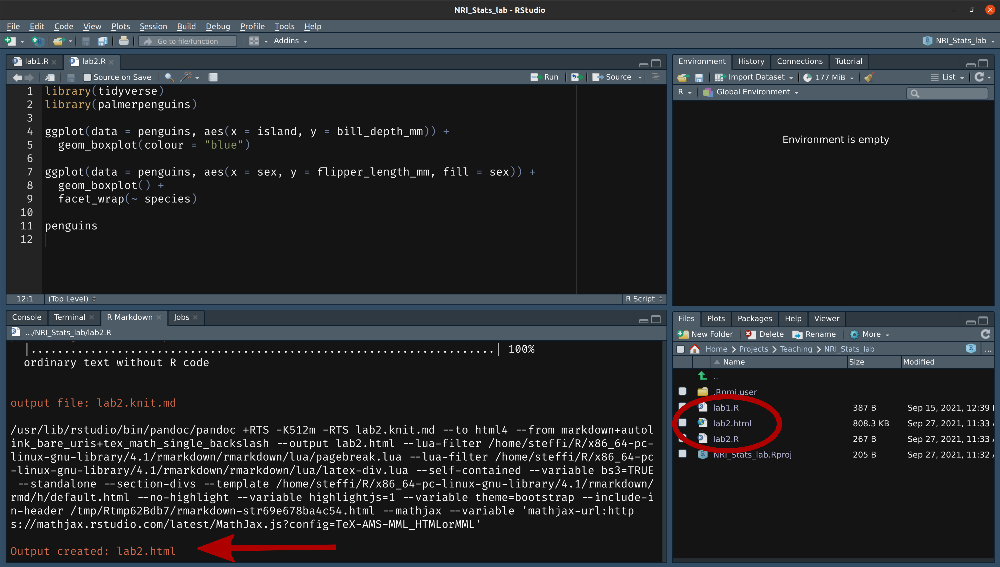
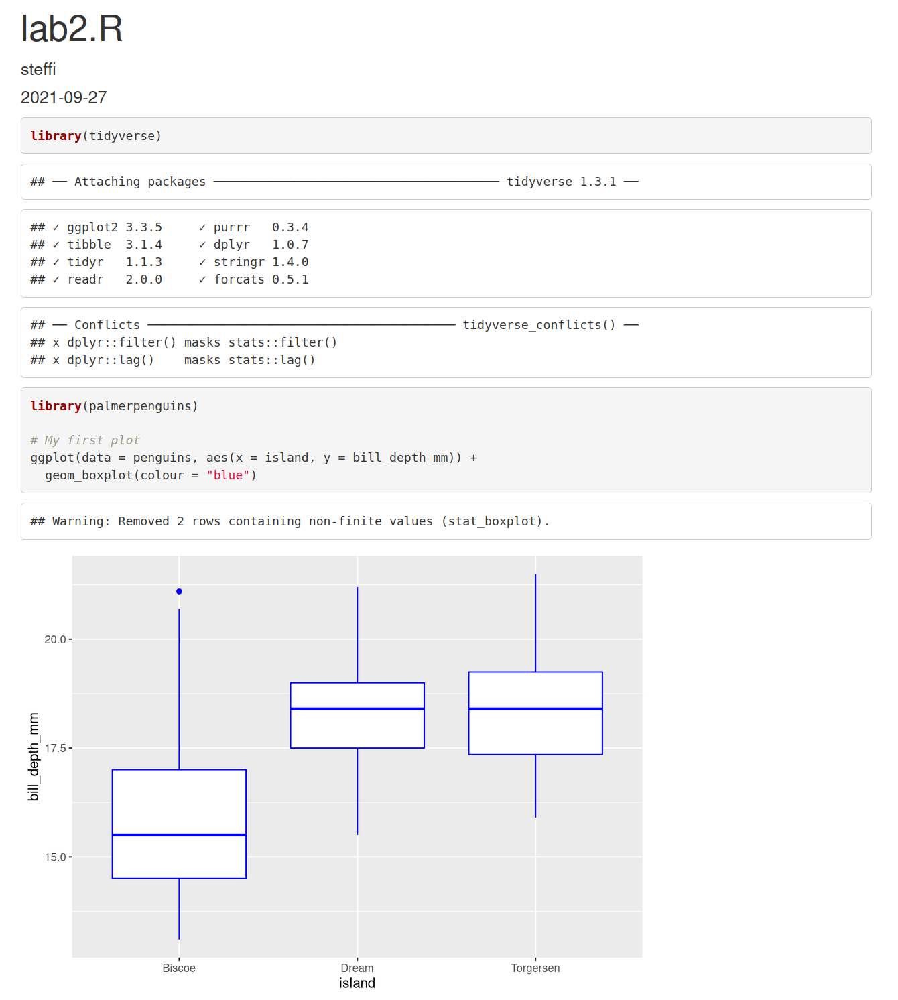
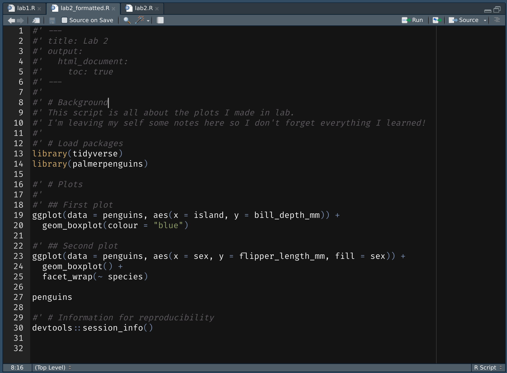
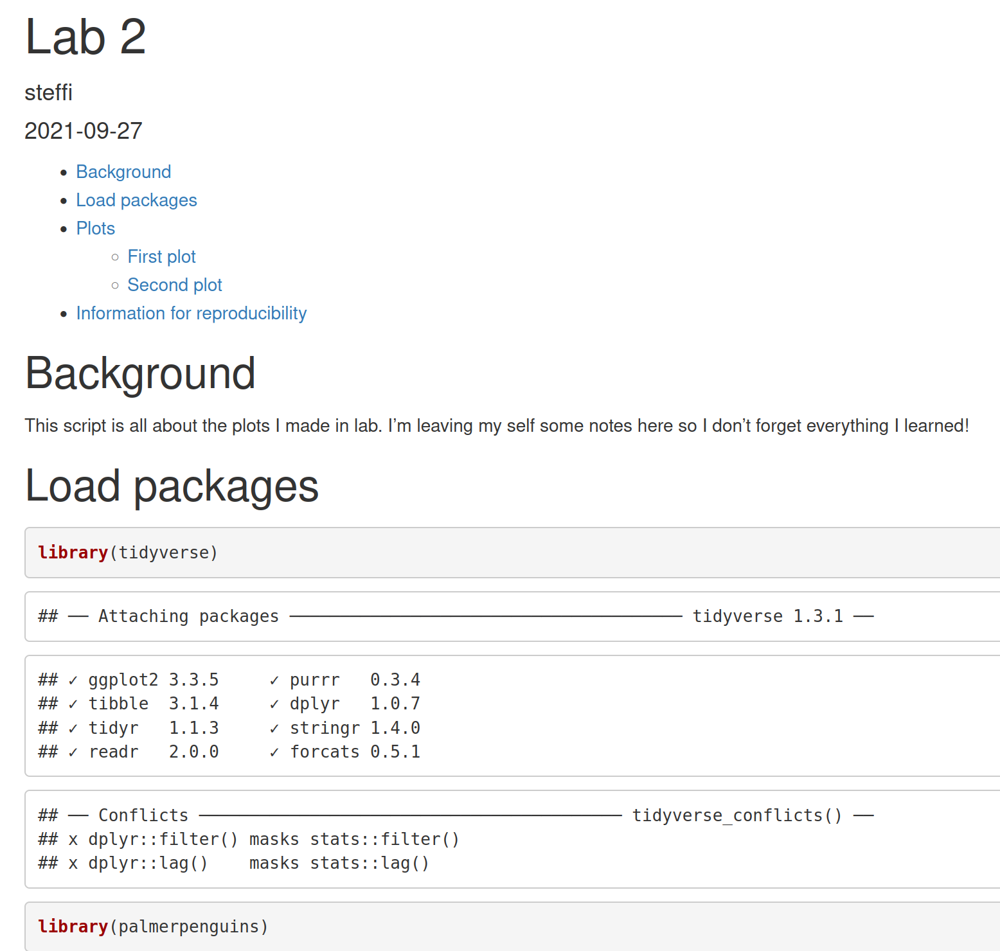
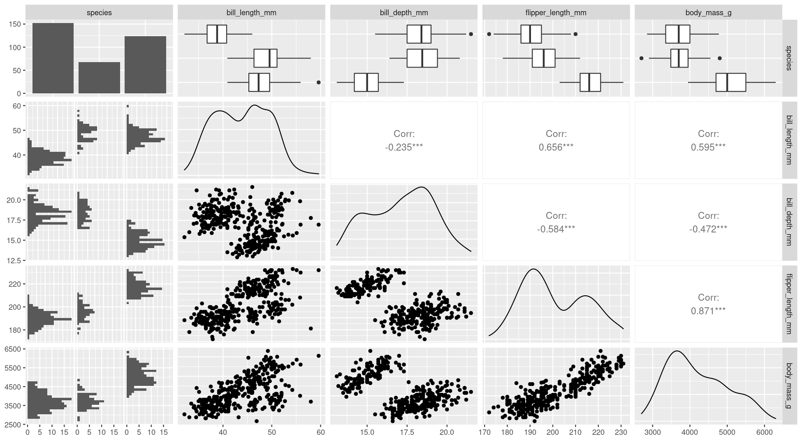
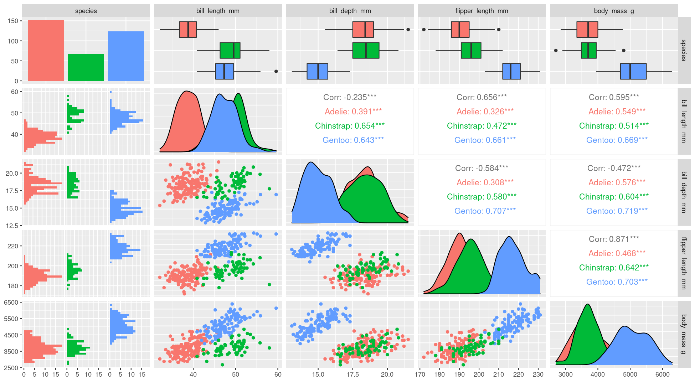

class: title-slide, nobar


.footnote[Artwork by [@allison_horst](https://github.com/allisonhorst/stats-illustrations)]


## NRI 7350
# Data<br>Exploration

.small[Also `GGally`, `skimr`, `dplyr`, and `moments`]

```{r setup, include = FALSE}
# 2021 Notes
# - How much skew/kurtosis is too much?

hide_answers <- params$hide_answers

knitr::opts_chunk$set(dpi = 150, fig.width = 8, out.width = "90%",
                      fig.align = "center", fig.asp = 0.45, cache = TRUE, 
                      warning = FALSE)
library(here)
library(flair)
library(glue)
library(ggplot2)
library(dplyr)
library(tidyr)
library(palmerpenguins)
options(width = 100)

purple <- "#440154"
teal <- "#277F8E"
```

---
# How Are we Doing? 

### Take Heart!  `r emo::ji("heart")`

.footnote[Artwork by [@allison_horst](https://github.com/allisonhorst/stats-illustrations)]

![:img right: 5px, bottom: 15px, 85%, An illustrated cartoon graph with 'How much I think I know about R' on the y-axis&comma; with axis labels at 'I know nothing' and 'I know lots'&comma; versus 'time' on the x-axis. The line varies widely between the two. Above the line are emoji-like faces&comma; showing uncertainty and hope early on. At a second peak is the label 'join R community on twitter'&comma; with a 'mind-blown' emoji face. The line quickly descends&comma; but with a happy looking emoji character sliding down it.](figures/r_rollercoaster.png)


---
class: section

# Learning to Compile Reports!

Open RStudio  
Open your NRI project  

<br>

Open a **old** script .small[(if it's not already open)]

'Files' pane (lower right) > Click on the script name

---




---



---
# Compile script into report




> This is **all I need**:
> - Your assignment answers 
> - This html report


---
# However!

## If you want to take it further: 
- You can use Markdown formating to make things look nice
- You just need to put `#'` in front of any Markdown notation or text (DEMO)

## Markdown

- `**bold**`
- `*italic*`
- `#`, `##`, `###` for headings (first-, second-, third-level)


> **Familiar with Rmd?**  
> 
> Think of this as the mirror image: 
> 
> Instead of marking **what is** R code, you mark **what is NOT** R code
> 

---
 


---
class: split-50, space-list
# Further reading



.columnl[
- [R Markdown Cookbook](https://bookdown.org/yihui/rmarkdown-cookbook/)
  - Chapter 3.3 [Render an R script to a report](https://bookdown.org/yihui/rmarkdown-cookbook/spin.html#spin)
- [R for Data Science](https://r4ds.had.co.nz)
  - Chapter 27 [Rmarkdown](https://r4ds.had.co.nz/r-markdown.html)
]

---
class: section

# Getting started (again)

**Hoping you can work with some of your own data today!**


Open RStudio  
Open your NRI project  
Open your data-loading script:

'Files' Pane > Click on script name

**RUN YOUR SCRIPT**

<br>

Make sure to load packages at the top:  
`library(tidyverse)`<br>
`library(palmerpenguins)`<br>.small[(if working with penguins today)]


---
class: section

# Exploring everything at once

---
# Visualize with `ggpairs()`

- From `GGally` package
  - **Caution!** If you have a lot of columns, `select()` only a few to work with

```{r pairs, include = FALSE}
library(GGally)

penguins_sub <- select(penguins, -sex, -island, -year)
ggpairs(penguins_sub)
```

```{r, echo = FALSE}
decorate("pairs", eval = FALSE)
```

---
# Side Note: `tidyverse` functions

- From `GGally`
  - **Caution!** If you have a lot of columns, `select()` only a few to work with


```{r, echo = FALSE}
decorate("pairs", eval = FALSE) %>%
  flair_rx("penguins([^_])", color = purple, before = "<strong>", after = "</strong>") %>%
  flair_rx("(sex)|(island)|(year)", color = "deeppink")
```

### `select()`
```{r, results = "asis", echo = FALSE}
glue("- `tidyverse` functions always start with the **data**, followed by other arguments\n",
     "- you can reference any **column** from '**data**'") %>%
  flair("data", color = purple) %>%
  flair("column", color = "deeppink") %>%
  cat()
```
- `select()` chooses columns to keep or to remove (with `-`)

```{r pairs, ref.label = "pairs", echo = FALSE, message = FALSE,  fig.show = "hide", fig.path = "./figures/", fig.asp = 0.55, fig.width = 13}
```

---
#  Visualize with `ggpairs()`




---
#  Visualize with `ggpairs()`

```{r pairs_setup, include = FALSE}
library(GGally)

ggpairs(select(penguins, -sex, -island, -year), aes(colour = species))
```

```{r, message = FALSE, echo = FALSE, cache = FALSE}
decorate("pairs_setup", message = FALSE, eval = FALSE) %>%
  flair("aes(colour = species)")
```

```{r pairs2, ref.label = "pairs_setup", echo = FALSE, message = FALSE, fig.show = "hide", fig.path = "./figures/", fig.asp = 0.55, fig.width = 13}
```


> `ggpairs()` builds on `ggplot()` so we can use an `aes()` specification

---
#  Visualize with `ggpairs()`




---
#  Visualize with `ggpairs()`

```{r, eval = FALSE}
library(GGally)
penguins_sub <- select(penguins, -sex, -island, -year)

ggpairs(penguins_sub)

ggpairs(penguins_sub, aes(colour = species))
```


---
# Summarize with `skim()`

### `skim()` from `skimr` package

```{r skim1, include = FALSE}
library(skimr)
skimp <- skim(penguins)
```


```{r, eval = FALSE}
library(skimr)
skim(penguins)
```

.small[
```{r echo = FALSE}
print(skimp)
```
]

---
# Summarize with `skim()`

### `skim()` from `skimr` package


```{r, eval = FALSE}
library(skimr)
skim(penguins)
```
.small[
```{r echo = FALSE}
print(skimp, include_summary = FALSE)
```
]

--


---
# Summarize with `skim()`

### `group_by` from `dplyr` package

```{r skim2, include = FALSE}
skimp <- group_by(penguins, species) 
skimp <- skim(skimp)
```

```{r skim2-2, include = FALSE}
penguins_sp <- group_by(penguins, species)
skim(penguins_sp)
```

```{r, echo = FALSE}
decorate("skim2-2", eval = FALSE)
```

---
# Side Note: `tidyverse` functions

### `group_by` from `dplyr` package

```{r, echo = FALSE}
decorate("skim2-2", eval = FALSE) %>%
  flair_rx("penguins([^_])", color = purple, before = "<strong>", after = "</strong>") %>%
  flair_rx("(species)", color = "deeppink")
```

### `group_by()`
```{r, results = "asis", echo = FALSE}
glue("- `tidyverse` functions always start with the **data**, followed by other arguments\n",
     "- you can reference any **column** from '**data**'") %>%
  flair("data", color = purple) %>%
  flair("column", color = "deeppink") %>%
  cat()
```
- `group_by()` assigns grouping to a data frame. Here, we group `penguins` by species


.small[
> **Extra:**
>
> In the console look at `penguins` (type in `penguins` and hit enter), 
> and then look at `penguins_sp` (type in `penguins_sp` and it enter). 
> 
> How does the output differ? (Hint very little! But there is one difference...)  

]


---
# Summarize with `skim()`

### `group_by` from `dplyr` package

```{r eval = FALSE}
penguins_sp <- group_by(penguins, species)
skim(penguins_sp)
```

.small[
```{r echo = FALSE}
print(skimp)
```
]

---
# Summarize with `skim()`

### `group_by` from `dplyr` package

```{r eval = FALSE}
penguins_sp <- group_by(penguins, species)
skim(penguins_sp)
```

.small[
```{r echo = FALSE}
print(skimp, include_summary = FALSE)
```
]


--


---
class: section

# Exploring variable by variable

Here, use the penguins data set

(explore your own for the assignment!)


---
class: split-25
# Visualize with `ggplot()`

### From last week...

.columnl[
- Histograms
]


.columnr[
```{r, fig.asp = 0.5, out.width = "100%", fig.width = 6}
ggplot(data = penguins, aes(x = bill_length_mm)) +
  geom_histogram(binwidth = 0.5)
```
]


---
class: split-25
# Visualize with `ggplot()`

### From last week...

.columnl[
- Histograms
- Scatterplots
]

.columnr[
```{r, fig.asp = 0.5, out.width = "100%", fig.width = 6}
ggplot(data = penguins, aes(x = bill_length_mm, y = body_mass_g)) +
  geom_point()
```
]

---
class: split-25
# Visualize with `ggplot()`

### From last week...

.columnl[
- Histograms
- Scatterplots
- Boxplots
]

.columnr[
```{r, fig.asp = 0.5, out.width = "100%", fig.width = 6}
ggplot(data = penguins, aes(x = species, y = body_mass_g)) +
  geom_boxplot()
```
]

---
class: split-30
# Visualize with `ggplot()`
### Histogram with Density

.columnl[
- Default uses counts
- Here use density  
  `y = ..density..`
- Same as density curve  
  `geom_density()`
- Use to assess shape and distribution of data
]

.columnr[
```{r hist-dens, include = FALSE}
ggplot(data = penguins, aes(x = bill_length_mm, y = ..density..)) + 
    geom_histogram(binwidth = 0.5) +
    geom_density()
```

```{r, echo = FALSE}
decorate("hist-dens", fig.asp = 0.5, out.width = "'100%'", fig.width = 6) %>%
  flair("y = ..density..") %>%
  flair("geom_density()")
```

]

--


---
class: split-30
# Visualize with `ggplot()`

### Histogram with Density

.columnl[
- Default uses counts
- Here use density  
  `y = ..density..`
- Same as density curve  
  `geom_density()`
- Use to assess shape and distribution of data
]

.columnr[
```{r, fig.asp = 0.45, out.width = "100%", fig.width = 6}
ggplot(data = penguins, aes(x = bill_length_mm, y = ..density..,
                            fill = species)) + 
    geom_histogram(binwidth = 0.5) +
    geom_density(alpha = 0.8)
```
]

--


---
class: split-30
# Visualize with `ggplot()`

### QQ Norm plots

.columnl[
- Assess whether data follows normal distribution
]

.columnr[
```{r, message = FALSE, , fig.asp = 0.5, out.width = "100%", fig.width = 6}
ggplot(data = penguins, aes(sample = bill_length_mm)) +
  stat_qq() +    # Add the points
  stat_qq_line() # Add the line
```
]

--


---
# Summarize with `summarize()` .small[Ha!]

- From `dplyr` package (part of `tidyverse`)

```{r sum-stats1, include = FALSE}
summarize(penguins, 
          mean_mass = mean(body_mass_g),
          sd_mass = sd(body_mass_g),
          median_mass = median(body_mass_g))
```

```{r, echo = FALSE}
decorate("sum-stats1", eval = FALSE)
```

---
# Side Note: `tidyverse` functions

- From `dplyr` package (part of `tidyverse`)

```{r, echo = FALSE}
decorate("sum-stats1", eval = FALSE) %>%
  flair("penguins", color = purple, before = "<strong>", after = "</strong>") %>%
  flair("mean_mass", color = teal, before = "<strong>", after = "</strong>") %>%
  flair("sd_mass", color = teal, before = "<strong>", after = "</strong>") %>%
  flair("median_mass", color = teal, before = "<strong>", after = "</strong>") %>%
  flair("body_mass_g", color = "deeppink", before = "<strong>", after = "</strong>")
```

### `summarize()`
```{r, results = "asis", echo = FALSE}
glue("- `tidyverse` functions always start with the **data**, followed by **other arguments**\n",
     "- you can reference any **column** from '**data**'\n",
     "- `summarize()` creates a data frame with **new columns** (summarizes your data)") %>%
  flair_rx("\\*\\*data\\*\\*", color = purple) %>%
  flair("other arguments", color = teal) %>%
  flair("column ", color = "deeppink") %>%
  flair("new columns", color = teal) %>%
  cat()
```

---
# Summarize with `summarize()`
- From `dplyr` package (part of `tidyverse`)

```{r, echo = FALSE}
decorate("sum-stats1", eval = TRUE)
```

--

> Why all `NA`s?

---
# Summarize with `summarize()`

- `mean()`, `sd()`, `median()`

```{r sum-stats2, include = FALSE}
summarize(penguins, 
          mean_mass = mean(body_mass_g, na.rm = TRUE),
          sd_mass = sd(body_mass_g, na.rm = TRUE),
          median_mass = median(body_mass_g, na.rm = TRUE))
```

```{r, echo = FALSE, cache = FALSE}
decorate("sum-stats2") %>%
  flair("na.rm = TRUE")
```


---
# Summarize with `summarize()`

- `mean()`, `sd()`, `median()`, `quantile()`, `n()`*

```{r sum-stats3, include = FALSE}
summarize(penguins, 
          mean_mass = mean(body_mass_g, na.rm = TRUE),
          sd_mass = sd(body_mass_g, na.rm = TRUE),
          median_mass = median(body_mass_g, na.rm = TRUE),
          q25_mass = quantile(body_mass_g, probs = 0.25, na.rm = TRUE),
          n = n(),                                                       # Sample size
          n_no_missing = sum(!is.na(body_mass_g)))                       # Non-missing sample size
```

```{r, echo = FALSE, cache = FALSE}
decorate("sum-stats3") %>%
  flair("n = n()") %>%
  flair("n_no_missing = sum(!is.na(body_mass_g)))")
```


.footnote[\* `n()` only works *inside* `summarize()`/`mutate()`]

---
# Your Turn: `summarize()`

Calculate summary statistics for **Bill Length**

```{r yt_summarize, include = FALSE}
summarize(penguins,
          mean_bill_length = mean(bill_length_mm, na.rm = TRUE),
          sd_bill_length = sd(bill_length_mm, na.rm = TRUE),
          median_bill_length = median(bill_length_mm, na.rm = TRUE),
          q25_bill_length = quantile(bill_length_mm, probs = 0.25, na.rm = TRUE),
          n_mass = n(),
          n_no_missing_mass = sum(!is.na(bill_length_mm)))
```

```{r, echo = FALSE}
decorate("yt_summarize", eval = FALSE) %>%
  mask("mean_bill_length = mean(") %>%
  mask("sd_bill_length = sd(") %>%
  mask("median_bill_length = median(") %>%
  mask("q25_bill_length = quantile(") %>%
  mask("n_mass = n()") %>%
  mask("n_no_missing_mass = sum(!is.na(") %>%
  mask(", na.rm = TRUE)") %>%
  mask("))") %>%
  mask(", probs = 0.25")
```

---
exclude: `r hide_answers`
# Your Turn: `summarize()`

Calculate summary statistics for **Bill Length**


```{r, echo = FALSE}
decorate("yt_summarize")
```


---
# Side Note: Removing `NA`s

- With arguments
    - `na.rm = TRUE` (summary stats i.e. `mean()`, `sd()`) 
    - `na.action = na.exclude` (models i.e., `lm()`, `lmer()`)
- You can remove all `NA`s from your data (`drop_na()`)
- You can selectively remove `NA`s from your data (`filter()`)


---
# Side Note: Removing `NA`s

### Remove **all** `NA`s
- This removes **every** row that has an `NA` in **any** column
- `drop_na()` function from `tidyr` package .small[(part of `tidyverse`)]

```{r drop, eval = FALSE}
penguins_no_na <- drop_na(penguins)
```

- Consider removing columns with lots of `NA`s first (assuming you don't need them)

```{r no-na, eval = FALSE}
penguins_no_na <- select(penguins, -sex) #<<
penguins_no_na <- drop_na(penguins_no_na)
```

---
#Side Side Note: `tidyverse` functions

- From `tidyr` package (part of `tidyverse`)

```{r, echo = FALSE}
decorate("drop", eval = FALSE) %>%
  flair_rx("(\\()penguins(\\))", color = purple, before = "<strong>", after = "</strong>")
```

### `drop_na()`
```{r, results = "asis", echo = FALSE}
glue("- `tidyverse` functions always start with the **data**, followed by other arguments\n",
     "- here, there are no other arguments") %>%
  flair_rx("\\*\\*data\\*\\*", color = purple) %>%
  cat()
```

---
# Side Note: Removing `NA`s

### Selectively remove `NA`s with `filter()`

- From `dplyr` package .small[(part of tidyverse)]

```{r filter, eval = FALSE}
filter(penguins, !is.na(body_mass_g)) 
```

- `is.na()` checks if there is an `NA` and returns `TRUE` if so
- `!` turns a `TRUE` into a `FALSE`
- `filter()` only keeps rows that are `TRUE`
- **Thus** any row with an `NA` in `body_mass_g` is removed

---
#Side Side Note: `tidyverse` functions

- From `dplyr` package (part of `tidyverse`)

```{r, echo = FALSE}
decorate("filter", eval = FALSE) %>%
  flair("penguins", color = purple, before = "<strong>", after = "</strong>") %>%
  flair("body_mass_g", color = "deeppink", before = "<strong>", after = "</strong>")
```

### `filter()`
```{r, results = "asis", echo = FALSE}
glue("- `tidyverse` functions always start with the **data**, followed by other arguments\n",
     "- you can reference any **column** from '**data**'\n",
     "- `filter()` keeps only rows that return `TRUE` to the logical statements") %>%
  flair("data", color = purple) %>%
  flair("column", color = "deeppink") %>%
  cat()
```


---
# Summarize with `summarize()` .small[(and `group_by()`)]

- Can also use `group_by()` to calculate summaries by groups

```{r}
penguins_sp <- group_by(penguins, species) #<<
summarize(penguins_sp, 
          mean_mass = mean(body_mass_g, na.rm = TRUE),
          sd_mass = sd(body_mass_g, na.rm = TRUE),
          median_mass = median(body_mass_g, na.rm = TRUE))
```


---
# Summarize with `summarize()` .small[(and `group_by()`)]

- Can also use `group_by()` to calculate summaries by groups

```{r, message = FALSE}
penguins_sp_sex <- group_by(penguins, species, sex) #<<
summarize(penguins_sp_sex, 
          mean_mass = mean(body_mass_g, na.rm = TRUE),
          sd_mass = sd(body_mass_g, na.rm = TRUE),
          median_mass = median(body_mass_g, na.rm = TRUE))
```

--


---
# Side Note: Where are the decimal points?

- `tibble` hides them for easy viewing

```{r, message = FALSE}
penguins_sum <- summarize(penguins_sp_sex, 
                          mean_mass = mean(body_mass_g, na.rm = TRUE),
                          sd_mass = sd(body_mass_g, na.rm = TRUE),
                          median_mass = median(body_mass_g, na.rm = TRUE))
penguins_sum
```
--


---
# Side Note: Where are the decimal points?

- `as.data.frame()` to see the raw data
```{r, message = FALSE}
as.data.frame(penguins_sum)
```

- Or click on the name in the Environment pane

---
# Side Note: Where are all my data?

```{r, echo = 2}
o <- options(width = 80)
penguins
options(o)
```

`... with 334 more rows, and 2 more variables: sex <fct>, year <int>`

---
# Side Note: Where are all my data?

```{r, echo = 2}
o <- options(width = 80)
print(penguins, n = Inf)
options(o)
```

---
# Side Note: Where are all my data?

```{r}
as.data.frame(penguins)
```


---
# Summarize with `summarize()`

###  `skewness()`, `kurtosis()`

- From `moments` package

```{r}
library(moments)

summarize(penguins, 
          skew_mass = skewness(body_mass_g, na.rm = TRUE),
          kurt_mass = kurtosis(body_mass_g, na.rm = TRUE))
```

.medium[
> 1. Normal distribution, skew = 0, kurtosis = 3*
> 2. Remember that it's best to evaluate the distribution **both** visually and statistically
]

.footnote[\* **_Excess_ kurtosis** would be 0 for a normal distribution, but this functions measures **kurtosis**]

---
# Summarize with `summarize()`

### Confidence Intervals

- By hand!
- 95% Confidence interval ranges from [mean - (1.96 * SE)] to [mean + (1.96 * SE)]
- You can also express this interval as:  mean +/- (1.96 * SE)
- Standard Errors (SE) can be calculated by SD / sqrt(n)

```{r ci, eval = FALSE}
summarize(penguins,
          mean_mass = mean(body_mass_g, na.rm = TRUE),
          sd_mass = sd(body_mass_g, na.rm = TRUE),
          n = n(),
          se_mass = sd_mass / sqrt(n),        # Calculate Standard Error
          ci_mass = 1.96 * se_mass,           # CI margin of error   
          ci_low_mass = mean_mass - ci_mass,  # The lower range
          ci_high_mass = mean_mass + ci_mass) # The upper range
```

---
# Summarize with `summarize()`

### Confidence Intervals

- By hand!
- 95% Confidence interval ranges from [mean - (1.96 * SE)] to [mean + (1.96 * SE)]
- You can also express this interval as:  mean +/- (1.96 * SE)
- Standard Errors (SE) can be calculated by SD / sqrt(n)

```{r, ref.label = "ci", echo = FALSE}

```


---
# Put it All Together

```{r all, eval = FALSE, message = FALSE,}
penguins_sp <- group_by(penguins, species)
summarize(penguins_sp, 
          mean_mass = mean(body_mass_g, na.rm = TRUE),
          sd_mass = sd(body_mass_g, na.rm = TRUE),
          q25_mass = quantile(body_mass_g, probs = 0.25, na.rm = TRUE),
          median_mass = median(body_mass_g, na.rm = TRUE),
          q75_mass = quantile(body_mass_g, probs = 0.25, na.rm = TRUE),
          n = n(),                                             
          n_no_missing = sum(!is.na(body_mass_g)),
          skew_mass = skewness(body_mass_g, na.rm = TRUE),
          kurt_mass = kurtosis(body_mass_g, na.rm = TRUE),
          se_mass = sd_mass / sqrt(n),
          ci_mass = 1.96 * se_mass,     
          ci_low_mass = mean_mass - ci_mass,  
          ci_high_mass = mean_mass + ci_mass)
```


---
# Put it All Together

```{r, message = FALSE, echo = FALSE}
penguins_sp <- group_by(penguins, species)
summarize(penguins_sp, 
          mean_mass = mean(body_mass_g, na.rm = TRUE),
          sd_mass = sd(body_mass_g, na.rm = TRUE),
          q25_mass = quantile(body_mass_g, probs = 0.25, na.rm = TRUE),
          median_mass = median(body_mass_g, na.rm = TRUE),
          q75_mass = quantile(body_mass_g, probs = 0.25, na.rm = TRUE),
          n = n(),                                             
          n_no_missing = sum(!is.na(body_mass_g)),
          skew_mass = skewness(body_mass_g, na.rm = TRUE),
          kurt_mass = kurtosis(body_mass_g, na.rm = TRUE),
          se_mass = sd_mass / sqrt(n),
          ci_mass = 1.96 * se_mass,     
          ci_low_mass = mean_mass - ci_mass,  
          ci_high_mass = mean_mass + ci_mass) %>%
  as.data.frame()
```

---
# Put it All Together .small[(**Advanced!**)]

### `pivot_longer()` transposes data
- from `tidyr` package .small[(part of `tidyverse`)]

```{r, message = FALSE,}
penguins_long <- pivot_longer(penguins, 
                              cols = c(bill_length_mm, bill_depth_mm, flipper_length_mm, body_mass_g),
                              names_to = "measurement", values_to = "values")

penguins_long
```

--


---
# Put it All Together .small[(**Advanced!**)]

```{r long_sum, eval = FALSE}
penguins_long_sp <- group_by(penguins_long, species, measurement)

summarize(penguins_long_sp, 
          mean = mean(values, na.rm = TRUE),
          sd = sd(values, na.rm = TRUE),
          q25 = quantile(values, probs = 0.25, na.rm = TRUE),
          median = median(values, na.rm = TRUE),
          q75 = quantile(values, probs = 0.25, na.rm = TRUE),
          n = n(),                                             
          n_no_missing = sum(!is.na(values)),
          skew = skewness(values, na.rm = TRUE),
          kurt = kurtosis(values, na.rm = TRUE))
```

---
# Put it All Together .small[(**Advanced!**)]


```{r, ref.label = "long_sum", echo = FALSE}

```

---
class: space-list
# All Data vs. Variable by Variable

### Depends on what you need
- `ggpairs()` and `skim()` 
    - Lots of data quickly summarized and examined
    - Less easily customized (but still possible!)
- `ggplot()` and `summarize()`
  - Take a bit longer to write out
  - Very customizable
  - Can easily include stats not available in `ggpairs()` and `skim()`


---
# Wrapping up: Further reading (all **Free**!)
- RStudio > Help > Cheatsheets > Data Transformation with dplyr

- [R for Data Science](https://r4ds.had.co.nz)
  - [Data transformation](https://r4ds.had.co.nz/transform.html)
  - [Exploratory Data Analysis](https://r4ds.had.co.nz/exploratory-data-analysis.html)


