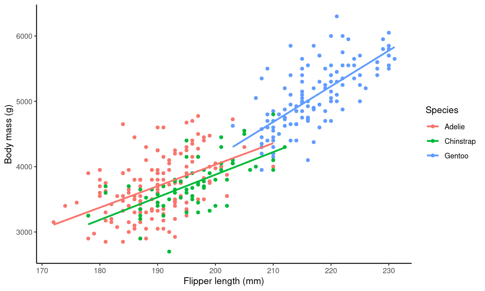
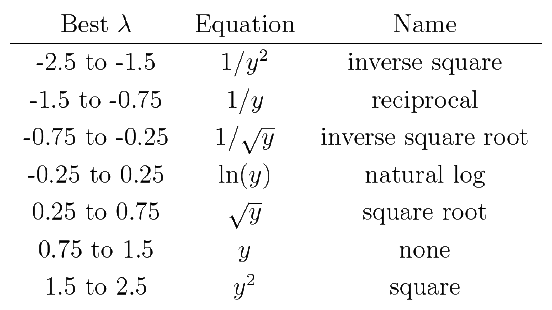

class: title-slide, nobar

```{r setup, include = FALSE}
## 2020
# - Fairly quick, ~ 45-60 min


hide_answers <- params$hide_answers

knitr::opts_chunk$set(dpi = 150, fig.width = 8, out.width = "90%",
                      fig.align = "center", fig.asp = 0.45, cache = FALSE, 
                      warning = FALSE)
library(here)
library(flair)
library(glue)
library(ggplot2)
library(MASS)
library(dplyr)
library(tidyr)
library(readr)
library(stringr)
library(palmerpenguins)
library(magrittr)
library(car)
options(width = 100)

purple <- "#440154"
teal <- "#277F8E"
green <- "darkgreen"

options(ggplot2.continuous.colour="viridis")
options(ggplot2.continuous.fill = "viridis")

library(knitr)
hook_output <- knit_hooks$get("output")
knit_hooks$set(output = function(x, options) {
  extra <- options$extra
  
  if(is.null(extra)) {
    return(hook_output(x, options))  # pass to default hook
  }
  x <- hook_output(x, options)
  if(any(extra == "compact")) x <- paste0("\n.compact[", x, "]")
  if(any(extra == "small")) x <- paste0("\n.small[", x, "]")
  if(any(extra == "compact_small")) x <- paste0("\n.compact[.small[", x, "]]")
  if(any(extra == "compact_extrasmall")) x <- paste0("\n.compact[.extra-small[", x, "]]")
  if(any(extra == "pause")) x <- paste0("--\n", x)
  x
})
```


```{r title-plot, include = FALSE, fig.path = "figures/", fig.asp = 0.6}
ggplot(data = penguins, aes(x = flipper_length_mm, y = body_mass_g, colour = species)) +
  theme_classic() +
  geom_point() +
  stat_smooth(method = "lm", se = FALSE) +
  labs(y = "Body mass (g)", x = "Flipper length (mm)", colour = "Species")
```




.footnote[Artwork by [@allison_horst](https://github.com/allisonhorst/stats-illustrations)]

## NRI 7350
# Advanced Linear Models

Transformations,   
Interactions, and  
Post-hoc tests

---
class: section

# Getting started (again)

Open RStudio  
Open your NRI project  
Open a **new** script for today:  

File > New File > R Script

<br>

Make sure to load packages at the top:  
`library(tidyverse)`    
`library(palmerpenguins)`    
`library(car)`

---
class: section

# Side Note
## Messages vs. Warnings vs. Errors

---
class: space-list

# Messages and Warnings and Errors (Oh my!)

- Not all coloured text is a problem
- Messages are just helpful information

```{r, fig.show = "hide"}
ggplot(data = drop_na(penguins), aes(x = body_mass_g, y = flipper_length_mm)) +
  stat_smooth()
```
    
---
class: space-list

# Messages and Warnings and Errors (Oh my!)
 
- Not all coloured text is a problem
- Messages are just helpful information
- Warnings should be considered **FYIs**. They might be a problem, but not always
    - Your code will run, even with a warning
    - Warnings always start with **Warning:**

```{r, warning = TRUE, fig.show="hide"}
ggplot(data = penguins, aes(x = sex, y = body_mass_g)) +
  geom_boxplot()
```

---
class: space-list

# Messages and Warnings and Errors (Oh my!)
 
- Not all coloured text is a problem
- Messages are just helpful information
- Warnings should be considered **FYIs**. They might be a problem, but not always
    - Your code will run, even with a warning
    - Warnings always start with **Warning:**
- Errors are always problems `r emo::ji("disappointed")`
    - Your code will stop with an error
    - Errors always start with **Error:**


```{r, error = TRUE}
ggplot(data = Penguins, aes(x = sex, y = body_mass_g)) +
  geom_boxplot()
```

--


---
class: section
# Data Transformations


---
class: split-50

# Transformations

## Non-normal residuals
.columnl[
```{r}
m <- lm(sleep_cycle ~ bodywt, data = msleep)

d <- data.frame(residuals = residuals(m),
                std_residuals = rstudent(m),
                fitted = fitted(m),
                cooks = cooks.distance(m))

d <- mutate(d, obs = 1:n())
```
]

.columnr[
```{r, fig.asp = 0.7, fig.width = 5}
ggplot(data = d, aes(sample = std_residuals)) +
  stat_qq() +
  stat_qq_line()
```
]


---
# Transformations

#### Order of Operations
1. See the need (i.e. non-normal residuals, heteroscedacity, etc.)
2. Figure out which transformation
3. Apply the transformation
4. Check model assumptions
5. Try again as needed


---
class: split-55
# Transformations: Common options

.columnl[
### Table of transformations in R

.small[
.spread[
```{r, eval = FALSE}
data_trans <- mutate(data, y_trans = 1/y^2)
data_trans <- mutate(data, y_trans = 1/y)
data_trans <- mutate(data, y_trans = 1/sqrt(y))
data_trans <- mutate(data, y_trans = log(y))
data_trans <- mutate(data, y_trans = log10(y))
data_trans <- mutate(data, y_trans = sqrt(y))
data_trans <- mutate(data, y_trans = y^2)
data_trans <- mutate(data, y_trans = (y^lambda - 1)/lambda)
data_trans <- mutate(data, y_trans = asin(sqrt(y/100)))
```
]]]

.columnr[
```{r, echo = FALSE, message = FALSE}
library(knitr)
library(kableExtra)
tribble(~ Transformation, ~ `R Code`,
        "Inverse square", "1/y^2",
        "Reciprocal", "1/y",
        "Inverse square root", "1/sqrt(y)",
        "Naural log (ln)", "log(y)",
        "Log base 10", "log10(y)",
        "Square root", "sqrt(y)",
        "Square", "y^2",
        "Box Cox", "(y^lambda - 1) / lambda",
        "Arcsine-sqare-root", "asin(sqrt(y/100))") %>%
  kable(format = "html") %>%
  kable_styling(position = "center", full_width = TRUE, font_size = 20) %>%
  column_spec(2, monospace = TRUE)
```
]


---
class: split-50

# Transformations: How to choose?

- Based on what you know (often discipline specific standards for certain data types)
- Based on what you see (does it look exponential or logarithmic?)
- Based on trial and error (try different transformations and see how it goes)
- Based on Box-Cox lambda $(\lambda)$  




.columnl[
.center[
**Can EITHER**   
**Apply $\lambda$ through Box-Cox transformation**     
**OR**    
**Use it to indicate best transformation &#8594;**  
]]

---
class: split-50

# Transformations: Box-Cox
### Finding $\lambda$


.columnl[

- **Use a plot of $\lambda$ **
    - `boxcox()` function from `MASS` package
    - Use `boxcox()` directly, otherwise `MASS` interferes with `select()`
```{r boxcox, message = FALSE, eval = FALSE}
b <- MASS::boxcox(m) 
```
]

.columnr[
```{r, echo = FALSE, fig.asp = 0.85, fig.width = 5}
par1 <- par(mar = c(4, 4, 1, 1))
b <- MASS::boxcox(m)
```
]

--

.columnl[
- **Get the exact $\lambda$**

```{r}
b$x[b$y == max(b$y)]
```
]


---
# Apply the transformation

```{r}
msleep_trans <- mutate(msleep, sleep_cycle = (sleep_cycle^(-0.26) - 1) / -0.26)
m_trans <- lm(sleep_cycle ~ bodywt, data = msleep_trans)
```

```{r echo = FALSE, message = FALSE, fig.asp = 0.4, out.width = "100%", fig.align = "center", fig.width = 10}
d_trans <- data.frame(residuals = residuals(m_trans),    # Residuals
                std_residuals = rstudent(m_trans), # Studentized Residuals
                fitted = fitted(m_trans),          # Fitted values
                cooks = cooks.distance(m_trans))   # Cook's D

d_trans <- mutate(d_trans, observation = 1:nrow(d_trans))      # Observation number

library(gridExtra)
grid.arrange(
ggplot(data = d, aes(sample = std_residuals)) +
  stat_qq() +
  stat_qq_line() +
  labs(title = "Q-Q Normality Plot: No transformation"),  
ggplot(data = d_trans, aes(sample = std_residuals)) +
  stat_qq() +
  stat_qq_line() +
  labs(title = "Q-Q Normality Plot: Box-Cox transformation"), nrow = 1)
```


---
class: section

# Interactions


---
# Interactions

### Interaction between Flipper Length and Species

Does the effect of Flipper Length on Body Mass depend on Species?  
(i.e. Are the slopes different?)

```{r, echo = FALSE, message = FALSE, fig.asp = 0.43}
ggplot(data = penguins, aes(x = flipper_length_mm, y = body_mass_g, colour = species)) +
  theme_classic() +
  geom_point() +
  stat_smooth(method = "lm", se = FALSE) +
  labs(y = "Body mass (g)", x = "Flipper length (mm)", colour = "Species")
```

---
# Interactions

### Interaction between Flipper Length and Bill Length

Does the effect of Flipper Length on Body Mass depend on Bill Length?  
(i.e. Does the slope of Flipper Length change with Bill Length?)


```{r, echo = FALSE, message = FALSE, fig.asp = 0.43}
p <- penguins %>%
  mutate(max = bill_length_mm > quantile(bill_length_mm, 0.75, na.rm = TRUE), 
         min = bill_length_mm < quantile(bill_length_mm, 0.25, na.rm = TRUE)) %>%
  filter(max == TRUE | min == TRUE) %>%
  mutate(type = if_else(min, "Short", "Long"))
ggplot(data = p, aes(x = flipper_length_mm, y = body_mass_g, colour = type)) +
  theme_classic() +
  geom_point(data = penguins, colour = "black") +
  stat_smooth(method = "lm", se = FALSE, size = 2) +
  labs(y = "Body mass (g)", x = "Flipper length (mm)", colour = "Bill Length")
```


---
# Interactions

```{r, echo = FALSE, results = "asis"}
glue("### Main Effects only .small[\\+]") %>%
  flair("Main Effects", color = teal, before = "<strong>", after = "</strong>") %>%
  cat()
```

```{r echo = FALSE}
decorate("m <- lm(body_mass_g ~ flipper_length_mm + bill_length_mm, data = penguins)") %>%
  flair("flipper_length_mm ",color = teal, 
        before = "<strong>", after = "</strong>") %>%
  flair("bill_length_mm", color = teal, before = "<strong>", after = "</strong>")
```

--

```{r, echo = FALSE, results = "asis"}
glue("### Main Effects and Interaction .small[\\+ :]") %>%
  flair("Main Effects", color = teal, before = "<strong>", after = "</strong>") %>%
  flair("Interaction", color = green, before = "<strong>", after = "</strong>") %>%
  cat()
```

```{r interaction2, include = FALSE}
m <- lm(body_mass_g ~ flipper_length_mm + bill_length_mm + flipper_length_mm:bill_length_mm, 
        data = penguins)
```


```{r, echo = FALSE}
decorate("interaction2") %>%
  flair("flipper_length_mm:bill_length_mm", color = green, 
        before = "<strong>", after = "</strong>") %>%
  flair("flipper_length_mm ",color = teal, 
        before = "<strong>", after = "</strong>") %>%
  flair("bill_length_mm ",color = teal, before = "<strong>", after = "</strong>")
```

--


```{r, echo = FALSE, results = "asis"}
glue("### *Both* Main Effects and Interaction .small[\\* (shortcut)]") %>%
  flair("Main Effects", color = teal, before = "<strong>", after = "</strong>") %>%
  flair("Interaction", color = green, before = "<strong>", after = "</strong>") %>%
  cat()
```

```{r echo = FALSE}
decorate("m <- lm(body_mass_g ~ flipper_length_mm * bill_length_mm, data = penguins)") %>%
  flair("flipper_length_mm", before = "<strong>", after = "</strong>") %>%
  flair("bill_length_mm", before = "<strong>", after = "</strong>") %>%
  flair("*", color = green, before = "<strong>", after = "</strong>") %>%
  flair_rx("\\_length", color = teal) %>%
  flair_rx("flipper|bill", color = green) %>%
  flair_rx("\\_mm", color = green)
  
```

--


> Don't forget your diagnostic plots!


--


---
# Interpreting Interactions
### Including Correlation Tables

```{r, echo = FALSE}
decorate("summary(m, correlation = TRUE)", eval = FALSE) %>%
  flair("correlation = TRUE")
```


.small[
```{r, echo = FALSE, highlight.output = 15:19}
cat(capture.output(summary(m, correlation = TRUE))[-c(1:9)], sep = "\n")
```
]

--


---
layout: true
# Interpreting Interactions

```{r, echo = FALSE}
o <- capture.output(summary(m))
```

---

```{r, echo = FALSE, highlight.output = 4}
cat(o[10:15], sep = "\n")
```


--

)[2], 2)` g for each 1 mm increase in Flipper Length)


--


---
```{r, echo = FALSE, highlight.output = 5}
cat(o[10:15], sep = "\n")
```


--

)[3], 2)` g for each 1 mm increase in Bill Length)

--


---
```{r, echo = FALSE, highlight.output = 6}
cat(o[10:15], sep = "\n")
```


--

)[4], 2)` g<br>(i.e. the slope of the relationship between Body Mass and Flipper Length increases&rpar;)

--


---


.footnote[Artwork by [@allison_horst](https://github.com/allisonhorst/stats-illustrations)]

---
layout: false
# Plotting Interactions
### Create new data frame with extremes

```{r, extra = "small"}
penguins_new <- expand(penguins,
                       flipper_length_mm = c(min(flipper_length_mm, na.rm = TRUE),
                                             max(flipper_length_mm, na.rm = TRUE)),
                       bill_length_mm = c(min(bill_length_mm, na.rm = TRUE),
                                          max(bill_length_mm, na.rm = TRUE)))
```

---
# Side Note: `tidyverse` functions

### Create new data frame with extremes

```{r expand, include = FALSE}
penguins_new <- expand(penguins,
                       flipper_length_mm = c(min(flipper_length_mm, na.rm = TRUE),
                                             max(flipper_length_mm, na.rm = TRUE)),
                       bill_length_mm = c(min(bill_length_mm, na.rm = TRUE),
                                          max(bill_length_mm, na.rm = TRUE)))
```


```{r, echo = FALSE}
decorate("expand") %>%
  flair("penguins,", color = purple, before = "<strong>", after = "</strong>") %>%
  flair("flipper_length_mm =", color = teal, before = "<strong>", after = "</strong>") %>%
  flair("bill_length_mm =", color = teal, before = "<strong>", after = "</strong>") %>%
  flair("flipper_length_mm,", color = "deeppink", before = "<strong>", after = "</strong>") %>%
  flair("bill_length_mm,", color = "deeppink", before = "<strong>", after = "</strong>")
```

### `expand()`
```{r, results = "asis", echo = FALSE}
glue("- from `tidyr` package .small[(part of the `tidyverse`)]\n",
     "- `tidyverse` functions always start with the **data**, followed by **other arguments**\n",
     "- you can reference any column from '**data**'\n",
     "- `expand()` creates a data frame with all possible combinations of new columns") %>%
  flair_rx("\\*\\*data\\*\\*", color = purple) %>%
  flair("other arguments", color = teal) %>%
  flair("column ", color = "deeppink", before = "<strong>", after = "</strong>") %>%
  flair("new columns", color = teal, before = "<strong>", after = "</strong>") %>%
  cat()
```


---
# Plotting Interactions

### Create new data frame with extremes

```{r, extra = "small"}
penguins_new <- expand(penguins,
                       flipper_length_mm = c(min(flipper_length_mm, na.rm = TRUE),
                                             max(flipper_length_mm, na.rm = TRUE)),
                       bill_length_mm = c(min(bill_length_mm, na.rm = TRUE),
                                           max(bill_length_mm, na.rm = TRUE)))
```

### Add predicted y values

- Use `predict()` function
  - `predict()` can be used on most statistical models
- Returns predicted `body_mass_g` values for new data

```{r, extra = "small"}
penguins_new <- mutate(penguins_new, body_mass_g = predict(m, newdata = penguins_new))
```


---
# Plotting Interactions

### Small data frame
- With values predicted from model
- Can plot this to illustrate interactions

```{r}
penguins_new
```


---
class: split-40
# Plotting Interactions

.columnl[
### Raw data (no model)
.small[
```{r points, eval = FALSE}
ggplot(data = penguins, 
       aes(x = flipper_length_mm, 
           y = body_mass_g,
           colour = bill_length_mm)) +
  geom_point(size = 2)
```
]]

.columnr[
.small[
```{r, ref.label = "points", echo = FALSE, fig.asp = 0.75, out.width = "100%", fig.width = 7, fig.align = "center"}
ggplot(data = penguins, aes(x = flipper_length_mm, y = body_mass_g,
                            colour = bill_length_mm)) +
  geom_point(size = 2)
```
]]

---
class: split-40
# Plotting Interactions

.columnl[
### Raw data + Model interaction
.small[
```{r lines, eval = FALSE}
ggplot(data = penguins, 
       aes(x = flipper_length_mm, 
           y = body_mass_g, 
           colour = bill_length_mm)) +
  geom_point(size = 2) +
  geom_line(data = penguins_new, #<<
            aes(group = bill_length_mm),  #<<
            size = 2) #<<
```
]]

.columnr[

```{r, ref.label="lines", echo = FALSE, fig.asp = 0.75, out.width = "100%", fig.width = 7, fig.align = "center"}

```
]


---
class: split-50
# Plotting Interactions
.columnl[
### From a Flipper Length perspective
.small[
```{r,  fig.asp = 0.6, fig.width = 5}
ggplot(data = penguins, aes(x = flipper_length_mm, 
                            y = body_mass_g, 
                            colour = bill_length_mm, 
                            group = bill_length_mm)) +
  geom_point() +
  geom_line(data = penguins_new, size = 2)
```
]
]

.columnr[
### From a Bill Length perspective
.compact[.small[
```{r,  fig.asp = 0.6, fig.width = 5}
ggplot(data = penguins, aes(x = bill_length_mm, 
                            y = body_mass_g, 
                            colour = flipper_length_mm, 
                            group = flipper_length_mm))+
  geom_point() +
  geom_line(data = penguins_new, size = 2)
```
]]]

---
# Visualizing Interactions

Not what you would present in a paper, but good to think about
```{r,  message = FALSE, echo = FALSE, fig.asp = 0.45, fig.width = 10, out.width = "100%"}
library(emmeans)
p <- emmip(m, bill_length_mm ~ flipper_length_mm, 
      at = list(bill_length_mm = seq(32.1, 59.6, 2),
                flipper_length_mm = seq(172, 231, 2)), plotit = FALSE)


g1 <- ggplot(data = penguins, aes(x = flipper_length_mm, y = body_mass_g, colour = bill_length_mm)) +
  theme(legend.position = "bottom") +
  geom_point() +
  geom_line(data = p, aes(y = yvar, group = bill_length_mm), size = 0.6) 

g2 <- ggplot(data = penguins, aes(x = bill_length_mm, y = body_mass_g, colour = flipper_length_mm)) +
  theme(legend.position = "bottom") +
  geom_point() +
  geom_line(data = p, aes(y = yvar, group = flipper_length_mm), size = 0.6) 

library(patchwork)

g1 + g2
```


---
class: section
# ANOVAs and Post-Hoc Tests

---
# Post-Hoc Tests

### From last week...
```{r anova1, include = FALSE}
m <- lm(body_mass_g ~ species + sex, data = penguins)
```

```{r, echo = FALSE}
decorate("anova1") %>%
  flair("body_mass_g", color = purple, before = "<strong>", after = "</strong>") %>%
  flair("species", color = "deeppink", before = "<strong>", after = "</strong>") %>%
  flair("sex", color = "deeppink", before = "<strong>", after = "</strong>")
```

```{r}
Anova(m, type = 3)
```

Differences within groups, but how are they different?

---
class: split-50
# Post-Hoc Tests

.columnl[
- Males significantly bigger than females
- Only two groups, so we can use the figure
]
.columnr[
- Are Adelie and Chinstrap the same size?
- Looks like it, but no statistical support
]

```{r, echo = FALSE, message = FALSE, out.width = "100%", fig.asp = 0.4}
g1 <- ggplot(data = drop_na(penguins), aes(x = sex, y = body_mass_g)) +
  geom_boxplot()
g2 <- ggplot(data = drop_na(penguins), aes(x = species, y = body_mass_g)) +
  geom_boxplot()
library(patchwork)
g1 + g2
```


--


---
# Estimated Marginal Means

### `emmeans()` function from `emmeans` package
- Calculates **estimated marginal means** (least-squares means) 
- Mean response of each factor, adjusting for other factors
- Can think of this as a predicted mean response if sample sizes were equal  
  (and controlling for other parameters)

```{r, message = FALSE, highlight.output = 6}
library(emmeans)
emm_sp <- emmeans(m, specs = "species")
emm_sp
```

---
class: split-35, space-list
layout: true
# Post-Hoc Tests .small[(All pair-wise)]

### `pairs()` function from `emmeans` packages

.columnl[
- Compare each combination

```{r pairs1, eval = FALSE}
pairs(emm_sp)
```
]

---
.columnr[

.medium[
```{r, ref.label = "pairs1", echo = FALSE}
```
]]

---
.columnr[

.medium[
```{r, ref.label = "pairs1", echo = FALSE, highlight.output = 2}
```
]]

.columnl[
**Differences in Body Mass**
.medium[
- Adelie penguins are **not** different from Chinstrap penguins   
   (P value = `r round(summary(pairs(emm_sp))$p.value[1], 3)`)
]]


---
.columnr[

.medium[
```{r, ref.label = "pairs1", echo = FALSE, highlight.output = 3}
```
]]

.columnl[
**Differences in Body Mass**
.medium[
- Adelie penguins are **not** different from Chinstrap penguins    
   (P value = `r round(summary(pairs(emm_sp))$p.value[1], 3)`)
- Adelie penguins **are** on average `r -1 * round(summary(pairs(emm_sp))$estimate[2], 1)` g lighter than Gentoo penguins (P value = < 0.0001)
]]

---
.columnr[

.medium[
```{r, ref.label = "pairs1", echo = FALSE, highlight.output = 4}
```
]]

.columnl[
**Differences in Body Mass**
.medium[
- Adelie penguins are **not** different from Chinstrap penguins   
  (P value = `r round(summary(pairs(emm_sp))$p.value[1], 3)`)
- Adelie penguins **are** on average `r -1 * round(summary(pairs(emm_sp))$estimate[2], 1)` g lighter than Gentoo penguins (P value = < 0.0001)
- Chinstrap penguins **are** on average `r -1 * round(summary(pairs(emm_sp))$estimate[3], 1)` g lighter than Gentoo penguins (P value < 0.0001)
]]

--


---
layout: false
# Post-Hoc Tests .small[(Dunnett's)]

### With `contrast()` function from `emmeans` package
- Dunnett's comparison is a type of contrast
- Each level compared to control
- Use `method = "trt.vs.ctrl"` OR `method = "dunnett"`

```{r}
contrast(emm_sp, method = "dunnett")
```

--

> Look familiar?

---
class: split-50
# Post-Hoc Tests .small[(Dunnett's)]

### Dunnett's treatment vs. control contrasts with `summary()` table

.small[
```{r, eval = FALSE}
summary(m)
```

```{r, echo = FALSE, highlight.output = 4:6}
cat(capture.output(summary(m))[9:14], sep = "\n")
```
]

### Dunnett's treatment vs. control contrasts with `emmeans`

.columnl[
.small[
```{r, highlight.output = 2:3}
contrast(emm_sp, method = "dunnett", adjust = "none")
```
]]

.columnr[
.small[
```{r, highlight.output = 2}
contrast(emmeans(m, specs = "sex"), method = "dunnett", 
         adjust = "none")
```
]]


---
class: split-50
# Post-Hoc Tests and P-Value adjustments

.footnote[\* Don't use "Bonferroni, [see this article](https://academic.oup.com/beheco/article/15/6/1044/206216)]

.columnl[
### No adjustment, too liberal?
```{r, extra = "small"}
pairs(emm_sp, adjust = "none")
```
]

.columnr[
### Extremely conservative\*
```{r, extra = "small"}
pairs(emm_sp, adjust = "bonferroni")
```
]


---
# Post-Hoc Tests and P-Value adjustments

### Middle of the road: Benjamini Hochberg (FDR, False Discovery Rate)\*
```{r}
pairs(emm_sp, adjust = "fdr")
```


.footnote[\* [See this article](https://academic.oup.com/beheco/article/15/6/1044/206216)]


--
> **No one best method**   
> What is your question? Are you more concerned about Type 1 or Type 2 error?


---
class: medium-table
# Post-Hoc Tests

### Test options

```{r, results = "asis", echo = FALSE}
tribble(~Argument, ~`P-Value Adjustment`, ~Reference,
        "none", "No P-Value Adjustment (essentially Fisher's LSD)", "",
        "tukey", "Tukey's HSD (Honestly significant difference), uses the Studentized range distribution with the number of means in the family.", "",
        "fdr", "Benjamini-Hochberg Test or False Discovery Rate Test", "http://www.jstor.org/stable/2346101",
        "bonferroni", "Bonferroni Correction", "", 
        "scheffe", "Computes p values from F distribution", "",
        "mvt", "Adjusted p values based on the joint normal or t distribution of the linear function", "",
        "holm", "Holm Test", "http://www.jstor.org/stable/4615733",
        "hochberg", "Hochberg Test", "https://doi.org/10.1093/biomet/75.4.800",
        "hommel", "Hommel Test", "https://doi.org/10.1093/biomet/75.2.383"
        ) %>%
  mutate(`P-Value Adjustment` = if_else(Reference != "",
                                        paste0("<a href = '", Reference, "'>", 
                                               `P-Value Adjustment`, "</a>"),
                                        `P-Value Adjustment`)) %>%
  dplyr::select(-Reference) %>%
  kable(format = "html", escape = FALSE) %>%
  kable_styling() %>%
  column_spec(1, monospace = TRUE) %>%
  cat()
```

---
# Post-Hoc Tests with Interactions


### Model: 2-way ANOVA
```{r}
m <- lm(body_mass_g ~ species * sex, data = penguins)
```


### Estimated Marginal Means
```{r, message = FALSE}
library(emmeans)
m_emms <- emmeans(m, specs = c("species", "sex"))
m_emms
```

---
class: split-35, space-list
layout: true
# Post-Hoc Tests with Interactions .small[(All pair-wise)]

### `pairs()` function from `emmeans` packages

.columnl[
- Compare each combination

```{r pairs2, eval = FALSE}
pairs(m_emms, adjust = "fdr")
```
]

---
.columnr[

.small[
```{r, ref.label = "pairs2", echo = FALSE}
```
]]

---
.columnr[

.small[
```{r, ref.label = "pairs2", echo = FALSE, highlight.output = 2}
```
]]

.columnl[
**Differences in Body Mass**
.medium[
- Female Adelie penguins **are** on average `r abs(round(summary(pairs(m_emms))$estimate[1], 0))` g smaller than female Chinstrap penguins (P value = `r round(summary(pairs(m_emms, adjust = "fdr"))$p.value[1], 3)`)
]]


---
.columnr[

.small[
```{r, ref.label = "pairs2", echo = FALSE, highlight.output = 14}
```
]]

.columnl[
**Differences in Body Mass**
.medium[
- Female Adelie penguins **are** on average `r abs(round(summary(pairs(m_emms))$estimate[1], 0))` g smaller than female Chinstrap penguins (P value = `r round(summary(pairs(m_emms, adjust = "fdr"))$p.value[1], 3)`)
- Male Adelie penguins are **not** different from male Chinstrap penguins (P value = `r round(summary(pairs(m_emms, adjust = "fdr"))$p.value[13], 3)`)
]]

---
.columnr[

.small[
```{r, ref.label = "pairs2", echo = FALSE, highlight.output = 4}
```
]]

.columnl[
**Differences in Body Mass**
.medium[
- Female Adelie penguins **are** on average `r abs(round(summary(pairs(m_emms))$estimate[1], 0))` g smaller than female Chinstrap penguins (P value = `r round(summary(pairs(m_emms, adjust = "fdr"))$p.value[1], 3)`)
- Male Adelie penguins are **not** different from male Chinstrap penguins (P value = `r round(summary(pairs(m_emms, adjust = "fdr"))$p.value[13], 3)`)
- Female Adelie penguins **are** on average `r abs(round(summary(pairs(m_emms, adjust = "fdr"))$estimate[3], 0))` g lighter than male Adelie penguins (P value = `r round(summary(pairs(m_emms, adjust = "fdr"))$p.value[3], 3)`)
]]


---
layout: false
class: split-70, space-list
# Post-Hoc Tests with Interactions

.columnl[
### Model: ANCOVA

```{r}
m <- lm(body_mass_g ~ flipper_length_mm * species, data = penguins)
```


### Estimated Marginal Means

- Here use `emtrends()` function from `emmeans` package
```{r, message = FALSE, extra = "small"}
m_emms <- emtrends(m, specs = "species", var = "flipper_length_mm")
m_emms
```

These are the effects of Flipper Length on Body Mass in each Species.
]

.columnr[
.medium[
**On average...**  

- Adelie: Body Mass increases by `r round(summary(m_emms)[1,2], 1)` g for each 1 mm increase in Flipper Length.
- Chinstrap: Body Mass increases by `r round(summary(m_emms)[2,2], 1)` g for each 1 mm increase in Flipper Length.
- Gentoo: Body Mass increases by `r round(summary(m_emms)[3,2], 1)` g for each 1 mm increase in Flipper Length.
]]

--


---
class: split-35, space-list
layout: true
# Post-Hoc Tests with Interactions .small[(All pair-wise)]

### `pairs()` function from `emmeans` packages

.columnl[
- Compare among species

```{r pairs3, eval = FALSE}
pairs(m_emms, adjust = "fdr")
```
]

---
.columnr[

.small[
```{r, ref.label = "pairs3", echo = FALSE}
```
]]

---
.columnr[

.small[
```{r, ref.label = "pairs3", echo = FALSE, highlight.output = 2}
```
]]


**Differences in the effect of Flipper Length on Body Mass**
.medium[
- The effect of Flipper Length on Body Mass is **not** different between Adelie and Chinstrap penguins (P value = `r round(summary(pairs(m_emms, adjust = "fdr"))$p.value[1], 3)`)
]


---
.columnr[

.small[
```{r, ref.label = "pairs3", echo = FALSE, highlight.output =3}
```
]]


**Differences in the effect of Flipper Length on Body Mass**
.medium[
- The effect of Flipper Length on Body Mass is **not** different between Adelie and Chinstrap penguins (P value = `r round(summary(pairs(m_emms, adjust = "fdr"))$p.value[1], 3)`)
- The effect of Flipper Length on Body Mass **is significantly less** in Adelie than in Gentoo penguins (Body Mass increases `r abs(round(summary(pairs(m_emms, adjust = "fdr"))$estimate[2], 1))` g less per 1mm increase in Flipper Length; P value = `r round(summary(pairs(m_emms, adjust = "fdr"))$p.value[2], 3)`)
]

---
.columnr[

.small[
```{r, ref.label = "pairs3", echo = FALSE, highlight.output = 4}
```
]]


**Differences in the effect of Flipper Length on Body Mass**
.medium[
- The effect of Flipper Length on Body Mass is **not** different between Adelie and Chinstrap penguins (P value = `r round(summary(pairs(m_emms, adjust = "fdr"))$p.value[1], 3)`)
- The effect of Flipper Length on Body Mass **is significantly less** in Adelie than in Gentoo penguins (Body Mass increases `r abs(round(summary(pairs(m_emms, adjust = "fdr"))$estimate[2], 1))` g less per 1mm increase in Flipper Length; P value = `r round(summary(pairs(m_emms, adjust = "fdr"))$p.value[2], 3)`)
- The effect of Flipper Length on Body Mass **is significantly less** in Chinstrap than in Gentoo penguins (Body Mass increases `r abs(round(summary(pairs(m_emms, adjust = "fdr"))$estimate[3], 1))` g less per 1mm increase in Flipper Length; P value = `r round(summary(pairs(m_emms, adjust = "fdr"))$p.value[3], 3)`)
]

--


---
layout: false
class: split-40, space-list
# Visualizing Interactions

```{r emmip, eval = FALSE}
emmip(m, species ~ flipper_length_mm, cov.reduce = range)
```

.columnl[
.medium[
- Here, **Linear prediction** = **y** = **Body Mass**
- Adelie and Chinstrap penguins have similar effects (i.e. slopes are **not** significantly different)
- Gentoo has a larger effect (i.e. slope **is** significantly larger) than either Adelie or Chinstrap penguins
]]
.columnr[
```{r, ref.label = "emmip", echo = FALSE, fig.asp = 0.7, out.width = "100%", fig.width = 6}
```
]

---
# Homework (Practice)*

Consider bill depth your response variable and species and year your predictor variables

1\. Convert year to a categorical variable and remove Gentoo penguins

```{r}
penguins_sub <- mutate(penguins, year = factor(year))
penguins_sub <- filter(penguins_sub, species != "Gentoo")
```

2\. Create a figure comparing bill depth to species and year. Think about how to best tease apart the relationships.

3\. Model the relationship between bill depth and the interaction between species and year.

4\. Check diagnostics

5\. How does the relationship of species and bill depth change among years?

.footnote[\* Not to be handed in, answers posted in these slides next week]


---
exclude: `r hide_answers`
# Homework (Practice) Answers

2\. Create a figure comparing body mass to bill depth and year

```{r, message = FALSE, out.width = "70%"}
ggplot(penguins_sub, aes(x = bill_depth_mm, y = body_mass_g, colour = year)) +
  geom_point() +
  stat_smooth(method = "lm", se = FALSE)
```


---
exclude: `r hide_answers`
class: split-50
# Homework (Practice) Answers

3\. Model the relationship between body mass and the interaction between bill depth and year.

```{r}
m <- lm(body_mass_g ~ bill_depth_mm * year, data = penguins_sub)
```

---
exclude: `r hide_answers`
# Homework (Practice) Answers

4\. Check your model diagnostics

```{r}
d <- data.frame(residuals = residuals(m),    
                std_residuals = rstudent(m), 
                fitted = fitted(m),          
                cooks = cooks.distance(m))   

d <- mutate(d, obs = 1:n())
d
```

---
exclude: `r hide_answers`
# Homework (Practice) Answers

4\. Check your model diagnostics - Normality

```{r, fig.asp = 0.7, out.width = "50%"}
ggplot(data = d, aes(sample = std_residuals)) +
  stat_qq() +
  stat_qq_line()
```


---
exclude: `r hide_answers`
# Homework (Practice) Answers

4\. Check your model diagnostics - Heteroscedasticity

```{r, fig.asp = 0.7, out.width = "50%"}
ggplot(d, aes(x = fitted, y = std_residuals)) +
  geom_point() +
  geom_hline(yintercept = 0)
```


---
exclude: `r hide_answers`
# Homework (Practice) Answers

4\. Check your model diagnostics - Influence (Cook's d)

```{r, fig.asp = 0.6, out.width = "50%"}
ggplot(d, aes(x = obs, y = cooks)) +
  geom_point() +
  geom_hline(yintercept = 4/nrow(penguins), 
             linetype = "dashed")
```


---
class: split-50
exclude: `r hide_answers`
# Homework (Practice) Answers

5\. How does the relationship of body mass and bill depth change among years?

.columnl[
.small[
```{r}
em <- emtrends(m, specs = "year", var = "bill_depth_mm")
pairs(em, adjust = "fdr")
```
]

.medium[
> No significant differences in the slopes among the years.
> i.e. the relationship between bill depth and body mass did not change among years.

]]

.columnr[
.small[
```{r,fig.asp = 0.8, fig.width = 6}
emmip(m, year ~ bill_depth_mm, cov.reduce = range)
```
]]


