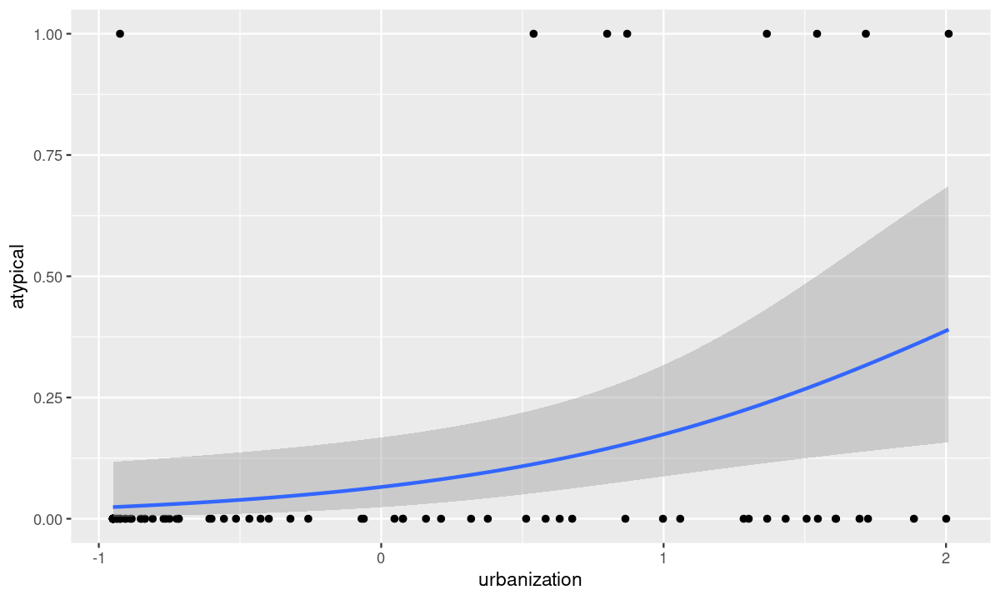
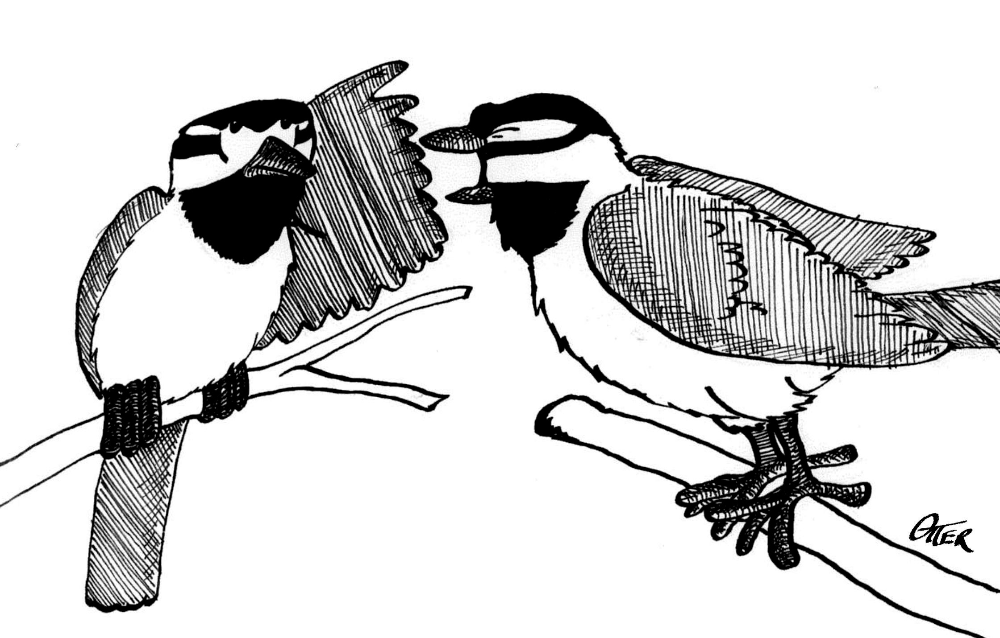
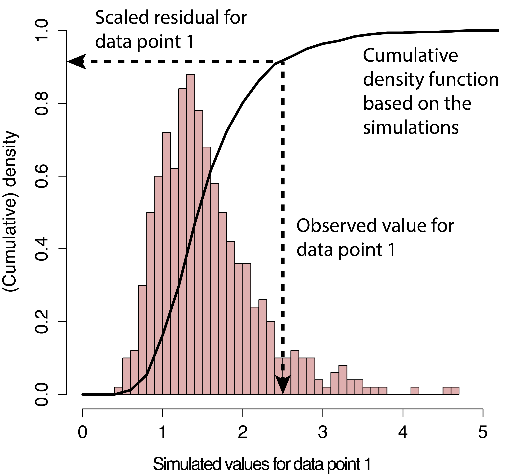
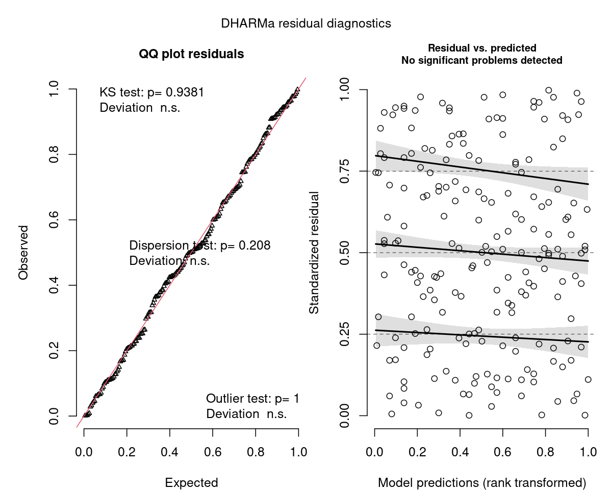
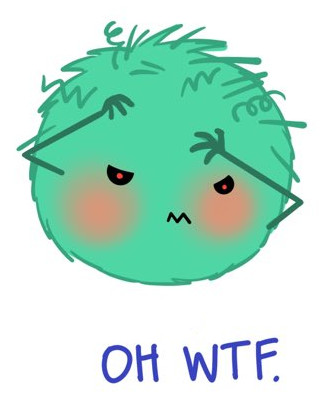
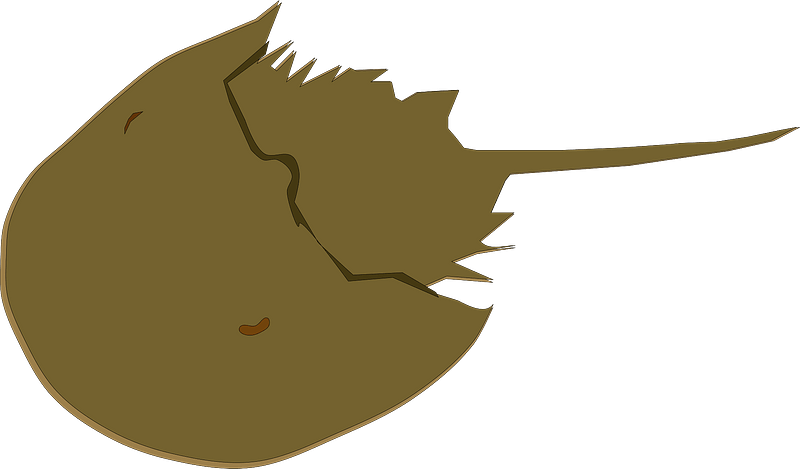

class: title-slide, nobar

```{r setup, include = FALSE}
# INCLUDE HOW TO CHOOSE AMONG MODELS


hide_answers <- params$hide_answers

knitr::opts_chunk$set(dpi = 150, fig.width = 8, out.width = "90%",
                      fig.align = "center", fig.asp = 0.45, cache = FALSE, 
                      warning = FALSE)
library(here)
library(flair)
library(glue)
library(ggplot2)
library(dplyr)
library(tidyr)
library(readr)
library(stringr)
library(patchwork)
library(magrittr)
library(kableExtra)
library(palmerpenguins)
options(width = 100)

purple <- "#440154"
teal <- "#277F8E"
green <- "darkgreen"

options(ggplot2.continuous.colour="viridis")
options(ggplot2.continuous.fill = "viridis")

library(knitr)
hook_output <- knit_hooks$get("output")
knit_hooks$set(output = function(x, options) {
  extra <- options$extra
  
  if(is.null(extra)) {
    return(hook_output(x, options))  # pass to default hook
  }
  x <- hook_output(x, options)
  if(any(extra == "compact")) x <- paste0("\n.compact[", x, "]")
  if(any(extra == "small")) x <- paste0("\n.small[", x, "]")
  if(any(extra == "compact_small")) x <- paste0("\n.compact[.small[", x, "]]")
  if(any(extra == "compact_extrasmall")) x <- paste0("\n.compact[.extra-small[", x, "]]")
  if(any(extra == "pause")) x <- paste0("--\n", x)
  x
})
```


```{r title-plot6, include = FALSE, fig.asp = 0.6, fig.path = "figures/"}
atypical <- read_csv("https://steffilazerte.ca/NRI_7350/data/atypical.csv")
ggplot(data = atypical, aes(x = urbanization, y = atypical)) +
  geom_point() +
  stat_smooth(method = "glm", method.args = list(family = "binomial"))
```




## NRI 7350
# Even more stats...

Generalized linear models,   
Other advanced models,   
Non-parametric stats

---
class: section

# Getting started (again)

Open RStudio  
Open your NRI project  
Open a **new** script for today:  

File > New File > R Script

<br>

Make sure to load packages at the top:  
`library(tidyverse)`    
`library(DHARMa)`


---
class: section

# Reference Material

This lecture covers A HUGE subject area

It is not comprehensive   

It is a place to start, with references to guide you later on   

---
class: section

# Diagnostics for complex models

### Introducing DHARMa

[DHARMa Tutorial](https://cran.r-project.org/web/packages/DHARMa/vignettes/DHARMa.html)   
.small[(Many great examples of model checking)]

---
class: space-list
# DHARMa Package


```{r dharma1, echo = FALSE, message = FALSE, fig.show="hide", fig.width = 8, fig.asp = 0.8, fig.path = "figures/"}
library(DHARMa)
p <- read_csv("https://stats.idre.ucla.edu/stat/data/poisson_sim.csv")
p <- mutate(p, program = factor(prog, levels = 1:3,
                                labels = c("General", "Academic", "Vocational")))
m <- glm(num_awards ~ math + program, family = "poisson", data = p)
orig <- par(mar = c(4,4,3,0))
r <- simulateResiduals(m, n = 1000, plot = TRUE)
par(orig)
```


### *Simulated* Residuals





- **If** your data perfectly matched your model,<br>what would the values look like?  
  - Pink histogram values show repeatedly<br>simulated values
  
   
--

- How do your *actual* values compare?  
  - Black arrow on x-axis shows *actual* value
  - Black arrow on y-axis shows residual:<br>
    how *actual* value compares to distribution<br>of simulated values

--

- Residuals are scaled (0 to 1)
  - If data fits model perfectly, expect all = 0.5
  - Good fit *always* = flat/uniform distribution

---
class: space-list
# DHARMa Package

### *If* data fits the model


- Residuals follow a flat (uniform)<br>distribution (no matter what  model!)  
   

--

- Expect: Straight line on QQ plot of<br>**uniform** distribution<br>.small[**(similar to QQ Normal plot)**]
- Expect: No patterns between<br>residuals and model predictions<br>.small[**(similar to heteroscedasticity plot, resid vs. fitted)**]



--


---
class: split-50
# DHARMa Package

.columnl[
### QQ Plot
.medium[
- Tests **Uniformity** with Kolmogorov-Smirnov (KS) test
  - (do the residuals match a Uniform distribution?)
- Tests for **Over/Underdispersion** with Dispersion Test
- Tests for more **Outliers** than expected with Outlier test
]

```{r, echo = FALSE, out.width = "100%", fig.width = 6, fig.asp = 0.65}
orig <- par(mar = c(4,4,3,0))
plotQQunif(r)
par(orig)
```
]

--

.columnr[
### Residuals vs. Predicted

.medium[

- Check distribution of residuals .small[(visually and with quantiles)]
- Dotted lines show expected quantiles
- Black lines show simulated quantiles (want straight lines)
- Outliers would show up as red stars
]

```{r, echo = FALSE, out.width = "100%", fig.width = 6, fig.asp = 0.65}
orig <- par(mar = c(4,4,3,0))
plotResiduals(r)
par(orig)
```

]

---
# DHARMa Package

### Usage

```{r fig.show="hide"}
library(DHARMa)

m <- lm(body_mass_g ~ flipper_length_mm, data = penguins)
r <- simulateResiduals(m, n = 1000, plot = TRUE)  #<<
```

- `simulateResiduals()` function from 
- Use `plot = TRUE` to produce diagnostic plots to see if simulated match expectation
- `n = 1000` isn't strictly necessary but runs more simulations to produce more stable results  


--
### Applies to any model

- REMEMBER! Not assessing normality of residuals or heteroscedacity...
- Assessing whether data fits the model
- This *includes* assumptions, but *also* includes general fit, etc.
- So, we can use this to see if our model could be improved...


---
# DHARMa Package

### Check a previous model

```{r, fig.show="hide"}
m <- lm(body_mass_g ~ flipper_length_mm, data = penguins)
r <- simulateResiduals(m, n = 1000, plot = TRUE)
```

```{r, echo = FALSE, fig.width = 10, fig.asp = 0.4}
orig <- par(mar = c(4,4,3,0))
r <- simulateResiduals(m, n = 1000, plot = TRUE)
par(orig)
```

--


---
# DHARMa Package

### Improve the fit...

```{r dharma_penguins, include = FALSE}
m <- lm(body_mass_g ~ flipper_length_mm + species * sex, data = penguins)
r <- simulateResiduals(m, n = 1000, plot = TRUE)
```

```{r, echo = FALSE}
decorate("dharma_penguins", eval = FALSE) %>%
  flair("species * sex")
```

```{r, echo = FALSE, fig.width = 10, fig.asp = 0.4}
orig <- par(mar = c(4,4,3,0))
r <- simulateResiduals(m, n = 1000, plot = TRUE)
par(orig)
```


---
class: section

# Comparing Models

### Model Selection


---
# Model Selection

### How do I know which model to use?

1. Check your diagnostics
  - Generally speaking, pick the model which has good diagnostics
  
  .spacer[]

--
  
  **All models have reasonably good diagnostics?**
  
  .spacer[]
  
--

2. Check model fit (how good is model at explaining data?)
  - Analysis of Variance/Deviance - `anova()`
    
  - Information Theoretic Approach (AIC) - `model.sel()` (MuMIn package)
      -  (covered in class Nov 17th)

--

> Many other methods, functions, packages


---
# `anova()` - Analysis of Variance/Deviance

### Very common in R

- Sequential analysis of variance for `lm()`
- Analysis of deviance for `glm()`

```{r results = "hide"}
p <- na.omit(penguins)  # Must have exact same dataset for each model

m1 <- lm(body_mass_g ~ flipper_length_mm, data = p)
m2 <- lm(body_mass_g ~ flipper_length_mm + species + sex, data = p)
m3 <- lm(body_mass_g ~ flipper_length_mm + species * sex, data = p)

anova(m1, m2, m3)
```

---
# `anova()` - Analysis of Variance/Deviance

```{r aov}
anova(m1, m2, m3)
```

---
# `anova()` - Analysis of Variance/Deviance

```{r ref.label= "aov", highlight.output = 3:5}
```

- Models being compared

---
# `anova()` - Analysis of Variance/Deviance

```{r ref.label= "aov", highlight.output = 7:9}
```

- Models being compared
- How the models compare

---
# `anova()` - Analysis of Variance/Deviance

```{r ref.label= "aov", highlight.output = 8}
```

- Models being compared
- How the models compare
    - m2 has significantly (P < 0.05) lower Sums Squares than m1

---
# `anova()` - Analysis of Variance/Deviance

```{r ref.label= "aov", highlight.output = 9}
```

- Models being compared
- How the models compare
    - m2 has significantly (P < 0.05) lower Sums Squares than m1
    - m3 has significantly (P < 0.05) lower Sums Squares than m2

--


---
# `model.sel()` - AIC model selection

```{r}
library(MuMIn)
model.sel(m1, m2, m3)
```

- m3 is the best (lowest AICc, and much lower than the others)
- For more specifics on how to use/interpret this table, 
  stay tuned for Nicky's lecture

--


> Always, remember that your 'best' model is only the best of what you've 
> compared...

---
class: section
# Generalized Linear Models

[Chapter 13, "The R Book" by Michael J. Crawley](https://search.lib.umanitoba.ca/permalink/01UMB_INST/k6qbb2/cdi_skillsoft_books24x7_bks00051275)  
.small[(Freely available online through University of Manitoba Library)]

---
# Generalized linear models


--


--

- Residuals are normally distributed
- Normally distributed also known as "Gaussian" distribution

--


---
# Generalized linear models

- One type of Generalized linear model


--

- So what if your residuals are *not* normal?
  - ie. they don't follow a Gaussian distribution  
  
  
--

- Try a different family!

--


--


--


--

- Etc.


---
# Generalized linear models

### Gaussian Family .small[(Normal data)]
```{r, eval = FALSE}
lm(y ~ x1 * x2, data = my_data)
```


```{r, echo = FALSE, message = FALSE, out.width = "80%", fig.asp = 0.5}
library(palmerpenguins)

g1 <- ggplot(data = penguins, aes(x = body_mass_g)) +
  geom_histogram() +
  labs(title = "Distribution of response")
g2 <- ggplot(data = penguins, aes(x = flipper_length_mm, y = body_mass_g)) +
  geom_point() +
  stat_smooth(method = "lm", se = FALSE) +
  labs(title = "Scatterplot")

g1 + g2
```


---
# Generalized linear models

### Poisson Family .small[(Count data)]
```{r, eval = FALSE}
glm(counts ~ x1 * x2, family = "poisson", data = my_data)
```

```{r, echo = FALSE, message = FALSE, out.width = "80%", fig.asp = 0.5}
p <- read_csv("https://stats.idre.ucla.edu/stat/data/poisson_sim.csv", 
              show_col_types = FALSE)
g1 <- ggplot(p, aes(x = num_awards))+
  geom_histogram(binwidth = 1) +
  labs(title = "Distribution of response")
g2 <- ggplot(p, aes(y = num_awards, x = math)) +
  geom_point() +
  geom_smooth(method = "glm", method.args = list(family = "poisson"), se = FALSE) +
  labs(title = "Scatterplot")
g1 + g2
```


---
# Generalized linear models

### Negative Binomial Family .small[(Overdispersed Count data)]
.small[
```{r, eval = FALSE}
MASS::glm.nb(counts ~ x1 * x2,  data = my_data)
```
]

- Do Poisson model first
- Check diagnostics, if necessary, you'll do a negative binomial model

```{r, echo = FALSE, message = FALSE, out.width = "80%", fig.asp = 0.4}
t <- tibble(y = rnbinom(n = 1000, size = 1, prob = 0.50)) %>%
   mutate(x = (1:n()) * (y + rnorm(n(), mean = 2, sd = 3)))

g1 <- ggplot(t, aes(x = y)) + 
  geom_histogram(binwidth = 1) +
  labs(title = "Distribution of response")
g2 <- ggplot(t, aes(x = x, y = y)) + 
  geom_point() +
  geom_smooth(method = MASS::glm.nb, se = FALSE) +
  labs(title = "Scatterplot")
g1 + g2
```


---
# Generalized linear models

### Binomial Family .small[(Binary data)]

- TRUE/FALSE, 0/1, Logistic Regression

```{r, eval = FALSE}
glm(y ~ x1 * x2, family = "binomial", data = my_data)
```


```{r, echo = FALSE, message = FALSE, out.width = "80%", fig.asp = 0.45}
t <- tibble(y = rbinom(n = 1000, size = 1, prob = 0.50)) %>%
  mutate(x = (1:n()) * (y + rnorm(n())))

g1 <- ggplot(t, aes(x = y)) + 
  geom_histogram() +
  labs(title = "Distribution of response")
g2 <- ggplot(t, aes(x = x, y = y)) + 
  geom_point() +
  geom_smooth(method = "glm", method.args = list(family = "binomial"), se = FALSE) +
  labs(title = "Scatterplot")
g1 + g2
```

---
# Generalized linear models

### Binomial Family .small[(Binary data)]

- TRUE/FALSE, 0/1, Logistic Regression

```{r, eval = FALSE}
glm(y ~ x1 * x2, family = "binomial", data = my_data)
```


### Binomial Family .small[(Proportion data)]

- Two responses (binary outcomes), each in it's own column 
  - .medium[(e.g., number of Yes, vs. No; Number of songs, vs. calls)]

```{r, eval = FALSE}
glm(cbind(yes, no) ~ x1 * x2, family = "binomial", data = my_data)
```


---
class: section

# Examples


---
# Count Data - Poisson Family


### Get the data
```{r, message = FALSE, extra = "small"}
p <- read_csv("https://stats.idre.ucla.edu/stat/data/poisson_sim.csv")
p <- mutate(p, program = factor(prog, levels = 1:3,
                                labels = c("General", "Academic", "Vocational")))
p
```


---
# Count Data - Poisson Family

### Look at the data

```{r, message = FALSE, fig.asp = 0.5, out.width = "75%"}
ggplot(data = p, aes(x = math, y = num_awards, colour = program)) +
  geom_point()
```

---
# Count Data - Poisson Family

### Look at the data

```{r, message = FALSE, fig.asp = 0.5, out.width = "70%"}
ggplot(data = p, aes(x = math, y = num_awards, colour = program)) +
  geom_point() +
  stat_smooth(method = "glm", se = FALSE) #<<
```
---
# Count Data - Poisson Family

### Look at the data

```{r, message = FALSE, fig.asp = 0.5, out.width = "70%"}
ggplot(data = p, aes(x = math, y = num_awards, colour = program)) +
  geom_point() +
  stat_smooth(method = "glm", method.args = list(family = "poisson"), se = FALSE) #<<
```


---
class: split-60
# Count Data - Poisson Family

### Run the model
```{r}
m <- glm(num_awards ~ math + program, family = "poisson", data = p)
```

---
class: split-60
# Count Data - Poisson Family

.columnl[

### Diagnostics

```{r eval = FALSE}
summary(m)
```

```{r, echo = FALSE, extra = "small", highlight.output = 14}
cat(capture.output(summary(m))[-c(1, 5:8)], sep = "\n")
```

]

.columnr[
### Overdispersion

.medium[
- Dispersion = Residual Deviance / DF
- Expected to be 1 for Poisson
- Overdispersion > 1; Underdispersion < 1
]]

---
class: split-60
# Count Data - Poisson Family

.columnl[

### Diagnostics

```{r eval = FALSE}
summary(m)
```

```{r, echo = FALSE, extra = "small", highlight.output = 17}
cat(capture.output(summary(m))[-c(1, 5:8)], sep = "\n")
```

]

.columnr[
### Overdispersion

.medium[
- Dispersion = Residual Deviance / DF
- Expected to be 1 for Poisson
- Overdispersion > 1; Underdispersion < 1
]

.medium[
**Traditional check:**
- Residual Deviance (`r round(deviance(m), 2)`) vs. DF (`r df.residual(m)`)
]
.small[
```{r}
deviance(m) / df.residual(m)
```
]

.medium[
- Almost 1 .small[(which it is good)]
]

.small[
```{r}
pchisq(deviance(m), df.residual(m), 
       lower.tail = FALSE)
```
]
.medium[
- Test shows no significant overdispersion  
  (p = 0.62)
]]


---
class: split-50
# Count Data - Poisson Family

### Diagnostics

- Residuals are complicated to assess in GLMs
- Therefore, use `DHARMa` package!

```{r poisson, message = FALSE, echo = 2, out.width = "100%", fig.width = 12, fig.asp = 0.3}
orig <- par(mar = c(4,4,3,0))
r <- simulateResiduals(m, n = 1000, plot = TRUE)
par(orig)
```

--


---
class: split-50
# Count Data - Poisson Family - Model Diagnostics

### Zero-inflation .small[(More zeros than expected)]

- Will often pop up as iffy residuals
- Overdispersion can lead to false positives
- Here not a problem (non-significant P-value)
```{r}
testZeroInflation(m, plot = FALSE)
```


---
class: split-60, space-list
# Count Data - Poisson Family

.columnl[
### Interpretation

```{r eval = FALSE}
summary(m)
```

```{r, echo = FALSE, extra = "small", highlight.output = 7:10}
cat(capture.output(summary(m))[-c(1, 5:8)], sep = "\n")
```
]

.columnr[
### Effects

.medium[
- Significantly more awards received with higher marks in math
  - i.e. Number of awards increases by 0.07 log-counts per 1 unit increase in Math mark
- Significantly more awards received in Academic Program compared to General
  - i.e. Number of awards greater by 1.08 log-counts for Academic compared to General
- No difference in amount of awards received in Vocational vs. General Program
]]


--




---
class: split-60, space-list
# Count Data - Poisson Family

.columnl[
### Interpretation

```{r eval = FALSE}
summary(m)
```

```{r, echo = FALSE, extra = "small", highlight.output = 7:10}
cat(capture.output(summary(m))[-c(1, 5:8)], sep = "\n")
```
]

.columnr[

### Interpreting Results
.medium[
- Convert to ratios with $e^{\textrm{est}}$ (`exp()`)
]
.small[
```{r}
data.frame(est = coef(m), 
           ratios = exp(coef(m)))
```
]

.medium[
- No. awards increases by 1.07 *times* per 1 unit increase in Math mark (7%)
- No. awards received by Academic is 2.96 *times* greater than in General program
]]


---
# Overdispersion

.medium[
- Overdispersion when data is spread out more than distribution would be (longer tails)
- Results in **highly** significant findings that are **not** valid!!
- Simulated residuals run from 0 to 1, but here more residuals around 0 and 1 (longer tails)
]

```{r overdisp, message = FALSE, echo = FALSE, out.width = "100%", fig.width = 12, fig.asp = 0.35}
overdisp <- createData(sampleSize = 200, overdispersion = 1.5, family = poisson())
m1 <- glm(observedResponse ~  Environment1 , family = "poisson", data = overdisp)
simulationOutput <- simulateResiduals(m1, n = 1000)
plot(simulationOutput)
```

---
# Underdispersion

.medium[
- Underdispersion is less common
- When data is gathered towards the centre more than distribution would be (shorter tails)
- These simulated residuals run from 0 to 1
- Here, more residuals around 0.5 (shorter tails)
]

```{r underdisp, message = FALSE, echo = FALSE, out.width = "100%", fig.width = 12, fig.asp = 0.35}
underdisp <- createData(sampleSize = 500, fixedEffects = 2, family = poisson(), roundPoissonVariance = 0.001, randomEffectVariance = 0)
m2 <- glm(observedResponse ~  Environment1 , family = "poisson", data = underdisp)
simulationOutput <- simulateResiduals(m2)
plot(simulationOutput)
```

---
class: split-50
# Overdispersed Count Data - Negative Binomial

```{r}
quine <- MASS::quine
```

.columnl[
### Poisson GLM
.medium[
```{r, echo = FALSE}
decorate("m1 <- glm(Days ~ Sex, data = quine, family = \"poisson\")\nsummary(m1)", eval = FALSE) %>%
  flair("glm") %>%
  flair("family = \"poisson\"")
```
]
.small[
```{r, echo = FALSE}
m1 <- glm(Days ~ Sex, data = quine, family = "poisson")
cat(capture.output(summary(m1))[9:19], sep = "\n")
```

]]

.columnr[
### Negative Binomial GLM
.medium[
```{r, echo = FALSE}
decorate("m2 <- MASS::glm.nb(Days ~ Sex, data = quine)\nsummary(m2)", eval = FALSE) %>%
  flair("MASS::glm.nb")
```
]
.small[
```{r, echo = FALSE}
m2 <- MASS::glm.nb(Days ~ Sex,  data = MASS::quine)
cat(capture.output(summary(m2))[10:20], sep = "\n")
```
]]


---
class: split-50
# Overdispersed Count Data - Negative Binomial

```{r}
quine <- MASS::quine
```

.columnl[
### Poisson GLM
.medium[
```{r, echo = FALSE}
decorate("m1 <- glm(Days ~ Sex, data = quine, family = \"poisson\")\nsummary(m1)", eval = FALSE) %>%
  flair("glm") %>%
  flair("family = \"poisson\"")
```
]
.small[
```{r, echo = FALSE, highlight.output = c(4, 11)}
m1 <- glm(Days ~ Sex,  data = MASS::quine, family = "poisson")
cat(capture.output(summary(m1))[9:19], sep = "\n")
```

]]

.columnr[
### Negative Binomial GLM
.medium[
```{r, echo = FALSE}
decorate("m2 <- MASS::glm.nb(Days ~ Sex, data = quine)\nsummary(m2)", eval = FALSE) %>%
  flair("MASS::glm.nb")
```
]
.small[
```{r, echo = FALSE, highlight.output = c(4, 11)}
m2 <- MASS::glm.nb(Days ~ Sex,  data = MASS::quine)
cat(capture.output(summary(m2))[10:20], sep = "\n")
```
]]


---
class: split-50
# Overdispersed Count Data - Negative Binomial

.columnl[
### Poisson GLM
```{r, out.width = "100%", fig.asp = 0.7, fig.width = 6}
r <- simulateResiduals(m1)
plotQQunif(r) # Just the first Uniformity Plot
```
]

.columnr[
### Negative Binomial GLM
```{r, out.width = "100%", fig.asp = 0.7, fig.width = 6}
r <- simulateResiduals(m2)
plotQQunif(r) # Just the first Uniformity Plot
```
]

--


---
# Binary Data (0/1) - Binomial Family .small[(logistic regresion)]

### Get the data
```{r, include = FALSE}
atypical <- read_csv("~/Projects/AAA Archive/MOCH - Atypical Songs/Data/Datasets/pca.csv") %>%
  select(atypical = atypical_c, urbanization = hab) %>%
  mutate(atypical = as.numeric(atypical)) %>%
  write_csv(here("./data/atypical.csv"))
```

- Mountain chickadees atypical songs by urbanization
- Negative `urbanization` more rural
- Positive `urbanization` more urban 
- `atypical_c` atypical singer (1) or 'normal' singer (0)

```{r, message = FALSE}
atypical <- read_csv("https://steffilazerte.ca/NRI_7350/data/atypical.csv")
atypical
```


---
# Binary Data (0/1) - Binomial Family .small[(logistic regresion)]

### Look at the data

```{r, message = FALSE, fig.asp = 0.5, out.width = "70%"}
ggplot(data = atypical, aes(x = urbanization, y = atypical)) +
  geom_point() +
  stat_smooth(method = "glm", method.args = list(family = "binomial"))
```


---
# Binary Data (0/1) - Binomial Family .small[(logistic regresion)]

### Run model and check diagnostics
.small[
```{r, out.width = "100%", fig.width = 12, fig.asp = 0.37}
m <- glm(atypical ~ urbanization, family = "binomial", data = atypical)
r <- simulateResiduals(m, plot = TRUE)
```
]


---
class: split-60
# Binary Data (0/1) - Binomial Family .small[(logistic regresion)]

.columnl[
```{r, extra = "small"}
summary(m)
```
]

.columnr[
### Interpreting Results

```{r}
exp(coef(m))
```

.medium[
E.g., The odds of being an atypical singer increase by a factor of `r x <- round(exp(coef(m)[2]), 2); x` (x`r x` times more likely) for every unit increase in Habit Urbanization.
]]


---
# Binary Outcomes - Binomial Family

Proportion with binary outcomes (e.g., 10 yes, 5 no)

### Get the data
```{r}
admissions <- as.data.frame(UCBAdmissions)
admissions <- pivot_wider(admissions, 
                          names_from = Admit, 
                          values_from = Freq) 
admissions
```

---
class: split-60
# Binary Outcomes - Binomial Family

.columnl[
### Diagnostics

```{r, extra = "small", results = "hide"}
m <- glm(cbind(Admitted, Rejected) ~ Gender, 
         family = "binomial", data = admissions)
summary(m)
```
```{r, cache = FALSE, extra = "small", echo = FALSE, highlight.output = 14}
cat(capture.output(summary(m))[-c(1, 5:8)], sep = "\n")
```
]

.columnr[

### Overdispersion

.medium[
**Traditional check:**
- Look at resid deviance (`r round(deviance(m), 2)`) vs. df (`r df.residual(m)`)
]

.small[
```{r}
deviance(m) / df.residual(m)
```
]

.medium[
- Very large .small[(definitely not close to 1)]
]

.small[
```{r}
pchisq(deviance(m), df.residual(m), 
       lower.tail = FALSE)
```
]
.medium[
- Test shows significant overdispersion
]]

---
# Binary Outcomes - Binomial Family


### Check with DHARMa

```{r, eval = FALSE}
plotQQunif(m)
plotResiduals(m, asFactor = TRUE) # to ensure Gender is treated as category
```

```{r, echo = FALSE, out.width = "100%", fig.width = 12, fig.asp = 0.35}
m <- glm(cbind(Admitted, Rejected) ~ Gender, family = "binomial", data = admissions)
wrap_elements(panel = ~plotQQunif(m)) + wrap_elements(~plotResiduals(m, asFactor = TRUE))
```


---
# Binary Outcomes - Quasi-binomial Family .small[for overdispersion]
```{r, extra = "small", highlight.output = 15}
m_quasi <- glm(cbind(Admitted, Rejected) ~ Gender, family = "quasibinomial", data = admissions)
summary(m_quasi)
```

--


---
# Binary Outcomes - Mixed models .small[for overdispersion]

- Observation-level random effects (i.e assign each observation an ID number)

```{r, extra = "small", message = FALSE, echo = -4, out.width = "100%", fig.width = 12, fig.asp = 0.35}
library(lme4)
admissions <- mutate(admissions, ID = 1:n())
m_glmm <- glmer(cbind(Admitted, Rejected) ~ Gender + (1|ID), family = "binomial", data = admissions)
wrap_elements(panel = ~plotQQunif(m_glmm)) + wrap_elements(~plotResiduals(m_glmm, asFactor = TRUE))
```


---
class: split-50
# Binary Outcomes - Overdispersion

Either way, fixing overdispersion remove the 'significance'

### Original 
```{r, extra = "small", highlight.output = 3}
coef(summary(m))
```


.columnl[
### Quasi fix
```{r, extra = "small", highlight.output = 3}
coef(summary(m_quasi))
```
]

.columnr[
### GLMM fix
```{r, extra = "small", highlight.output = 3}
coef(summary(m_glmm))
```
]


---
class: split-30
# Your Turn!
```{r, include = FALSE}
# Not available right now, but have the data
#data("CrabSatellites", package = "countreg")
#write_csv(CrabSatellites, here("./data/crabs.csv"))
```

.columnl[
We have the `crabs` dataset
]
.columnr[
```{r, message = FALSE}
crabs <- read_csv("https://steffilazerte.ca/NRI_7350/data/crabs.csv")
```
]


### Background

- Horseshoe crabs form pairs for spawning (mating)
- But extra, unattached males crowd around and try to get involved (Satellite males)

### Your Job
You're interested in the effect of female size (`width`) on the number of male `satellites`

- Look at your data (make a plot)
- Run a `glm()` for count data
- Check your diagnostics. Do you have a problem? Check for overdispersion and zero-inflation
- Apply an overdispersion fix
- Check your diagnostics. Do you have a problem? Check for zero-inflation



.footnote[Brockmann HJ (1996). “Satellite Male Groups in Horseshoe Crabs, *Limulus polyphemus*”, Ethology, 102(1), 1–21.]

---
exclude: `r hide_answers`
# Your Turn!


### Look at your data
```{r, out.width = "70%", message = FALSE}
ggplot(data = crabs, aes(x = weight, y = satellites)) +
  geom_point() +
  stat_smooth(method = "glm", method.args = list(family = "poisson"))
```

---
exclude: `r hide_answers`
# Your Turn!


### Run a `glm()` for count data

.small[
```{r}
m <- glm(satellites ~ weight, data = crabs, family = "poisson")
summary(m)
```
]

---
exclude: `r hide_answers`
# Your Turn!


### Check your diagnostics
- Do you have a problem? Check for overdispersion and zero-inflation

```{r, out.width = "100%", fig.width = 12, fig.asp = 0.35}
r <- simulateResiduals(m, plot = TRUE)
```

---
class: split-50
exclude: `r hide_answers`
# Your Turn!


### Check your diagnostics
- Do you have a problem? Check for overdispersion and zero-inflation

```{r yt_test1, eval = FALSE}
testZeroInflation(m)
```

.columnl[
.small[
```{r echo = FALSE, ref.label="yt_test1", fig.keep="none"}
```
]]

.columnr[
```{r ref.label = "yt_test1", results = "hide", echo = FALSE, out.width = "100%", fig.asp = 0.60}
```
]


---
exclude: `r hide_answers`
# Your Turn!


### Apply an overdispersion fix

.small[
```{r}
m <- MASS::glm.nb(satellites ~ weight, data = crabs)
summary(m)
```
]

---
exclude: `r hide_answers`
# Your Turn!


### Check your diagnostics
- Do you still have a problem? Check for overdispersion and zero-inflation

```{r, out.width = "100%", fig.width = 12, fig.asp = 0.35}
r <- simulateResiduals(m, plot = TRUE)
```

---
class: split-50
exclude: `r hide_answers`
# Your Turn!


### Check your diagnostics
- Do you still have a problem? Check for overdispersion and zero-inflation

```{r yt_test2, eval = FALSE}
testZeroInflation(m)
```

.columnl[
.small[
```{r echo = FALSE, ref.label="yt_test2", fig.keep="none"}
```
]]

.columnr[
```{r ref.label = "yt_test2", results = "hide", echo = FALSE, out.width = "100%", fig.asp = 0.60}
```
]


---
# Zero-inflated Models .small[(Advanced example! Above and beyond!)]


- `glmmTMB()` function from `glmmTMB` package
- Allows modeling zero-inflation (`ziformula` says zeros are a function of the variable `weight`)

.small[
```{r message = FALSE, results = "hide"}
crabs <- read_csv("https://steffilazerte.ca/NRI_7350/data/crabs.csv")
library(glmmTMB)
m <- glmmTMB(satellites ~ weight, ziformula = ~ weight , family = "nbinom2", data = crabs)
summary(m)
```

```{r, echo = FALSE}
cat(capture.output(summary(m))[c(10:24)], sep = "\n")
```
]

---
# Zero-inflated Models .small[(Advanced example! Above and beyond!)]


- `glmmTMB()` function from `glmmTMB` package
- Allows modeling zero-inflation (`ziformula` says zeros are a function of the variable `weight`)

.small[
```{r message = FALSE, results = "hide"}
crabs <- read_csv("https://steffilazerte.ca/NRI_7350/data/crabs.csv")
library(glmmTMB)
m <- glmmTMB(satellites ~ weight, ziformula = ~ weight , family = "nbinom2", data = crabs)
summary(m)
```

```{r, echo = FALSE, highlight.output = 3:6}
cat(capture.output(summary(m))[c(10:24)], sep = "\n")
```
]


---
# Zero-inflated Models .small[(Advanced example! Above and beyond!)]


- `glmmTMB()` function from `glmmTMB` package
- Allows modeling zero-inflation (`ziformula` says zeros are a function of the variable `weight`)

.small[
```{r message = FALSE, results = "hide"}
crabs <- read_csv("https://steffilazerte.ca/NRI_7350/data/crabs.csv")
library(glmmTMB)
m <- glmmTMB(satellites ~ weight, ziformula = ~ weight , family = "nbinom2", data = crabs)
summary(m)
```

```{r, echo = FALSE, highlight.output = 10:13}
cat(capture.output(summary(m))[c(10:24)], sep = "\n")
```
]


---
# Zero-inflated Models .small[(Advanced example! Above and beyond!)]
```{r, out.width = "100%", fig.width = 12, fig.asp = 0.4}
r <- simulateResiduals(m, plot = TRUE)
```


.footnote[For more information on the glmmTMB package see their [Journal Article](https://journal.r-project.org/archive/2017/RJ-2017-066/RJ-2017-066.pdf)]


---
class: split-50
# Zero-inflated Models .small[(Advanced example! Above and beyond!)]


.footnote[For more information on the glmmTMB package see their [Journal Article](https://journal.r-project.org/archive/2017/RJ-2017-066/RJ-2017-066.pdf)]


```{r yt_test3, eval = FALSE}
testZeroInflation(m)
```

.columnl[
.small[
```{r echo = FALSE, ref.label="yt_test2", fig.keep="none"}
```
]]

.columnr[
```{r ref.label = "yt_test2", results = "hide", echo = FALSE, out.width = "100%", fig.asp = 0.60}
```
]


---
class: section

# Packages and References for <p> Other Advanced Models


---
# Packages and References

### (Generalized) Linear Mixed Models (LMM, GLMM)
- Also called generalized linear mixed effects models (GLME, LME)
- `lme4` - More advanced, crossed-random factors, Generalized (`glmer()`) and Gaussian (`lmer()`)
- `nlme` - Older but can specify auto-correlation structures, only Gaussian (`lme()`)
- `glmmTMB` - Zero-inflated models and other distribtions

**References**

- [Ben Bolker's GLMM FAQ](https://bbolker.github.io/mixedmodels-misc/glmmFAQ.html)
- [Chapter 19, "The R Book" by Michael J. Crawley](https://search.lib.umanitoba.ca/permalink/01UMB_INST/k6qbb2/cdi_skillsoft_books24x7_bks00051275)  
.small[(Freely available online through University of Manitoba Library)]
- [Mixed Effects Models and Extensions in Ecology with R by Alain Zuur](https://search.lib.umanitoba.ca/permalink/01UMB_INST/1p55dqn/alma99149017057101651)    
.small[(Freely available online through University of Manitoba Library)]
- [Generalized linear mixed models: a practical guide for ecology and evolution](https://search.lib.umanitoba.ca/permalink/01UMB_INST/k6qbb2/cdi_proquest_miscellaneous_66983023), 2009, Trends in ecology and evolution

---
# Packages and References

### General Additive Models (GAM)
- `mgcv` package (`gam()`, `gamm()`)
- `gamm4` package (`gamm4()`)

**References**

- [Chapter 19, "The R Book" by Michael J. Crawley](https://search.lib.umanitoba.ca/permalink/01UMB_INST/k6qbb2/cdi_skillsoft_books24x7_bks00051275)  
.small[(Freely available online through University of Manitoba Library)]
- "Generalized Additive Models: An Introduction with R" by Simon N. Wood   
.small[(Hard-copy available from University of Manitoba Library)]

---
# Packages and References

### Generalized Estimating Equations (GEE)
- `gee` package (`gee()`)
- `geepack` package (`geeglm()`)

**References** 

- [The R package geepack for Generalized Estimating equations](https://www.jstatsoft.org/article/view/v015i02), Journal of Statistical Software, 2005
- [geepack Manual](https://cran.r-project.org/web/packages/geepack/vignettes/geepack-manual.pdf)

---
class: section

# Non-parametric Statistics

---
# Non-parametric Statistics

### Wilcoxon Rank Sum (Mann-Whitney) Test

```{r}
air <- filter(airquality, Month %in% c(5, 8))
```

Is there a difference in air quality between May (5th month) and August (8th month)?
```{r}
wilcox.test(Ozone ~ Month, data = air, exact = FALSE)
```

Yes!

---
# Non-parametric Statistics

### Kruskal-Wallis Rank Sum Test

Is there a difference in air quality among months?

```{r}
kruskal.test(Ozone ~ Month, data = airquality)
```

Yes, there is at least one month that is different from the rest.
